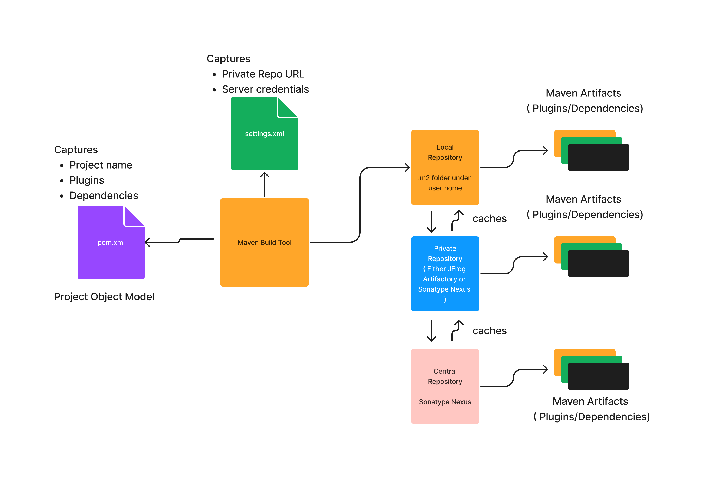

# Day 1 

## Ant build tool

- developed by Apache Foundation as an Open source build tool
- mainly used for Java projects as a build tool
- build.xml captures the project name and build instructions
- Ant doesn't haven't dependency management support
- Ant has conventions for java project directory structure, hence different project teams follow different folder structure and this leads to confusion


## Apache Maven build tool
- developed by Apache Foundation as an Open source build tool
- mainly used by Java projects as build tool but also works with other programming language stack
- has conventions for pretty much anything
    - it has conventions on how to name your projects
    - it has conventions on the folder structure ie where to place application source code, where to place test code
- convention over configuration
    - maven uses pom.xml to capture project name as Maven co-ordinates
    - maven has specific section where Maven depedencies can be captured
    - maven has specific section where your project dependencies can be captured
- Maven Co-ordinates
   - uses 3 co-ordinates
       1. GroupId 
           - string that can represents your organization reverse domain name 
           - to avoid naming collision within your organization, you can also append your project name
       2. ArtifactId 
          - name of jar/war/ear/zip 
       3. Version - x.y.z
            x - major version
            y - minor version
            z - incremental version
   - maven project names are unique combination of Maven coordinates
- Maven Plugins
  - these are jar files just like Maven dependencies
  - these plugins are required for Maven to compile your application or package your appliction binaries as a jar/war/ear/zip file, etc.,
  - Maven has plugins for every purpose
  - Maven has a plugin for compiling application code
  - Maven has a plugin for cleaning target folder that has application compiled/packaged binaries
  - Maven has plugin(s) for packaging your application as jar file, war file or ear file, etc.
  - Maven has plugin(s) for deploying application jars into external environment
     - you have a plugin to deploy jars to weblogic
     - you have a plugin to deploy jars to tomcat
     - you have built-in plugin to deploy jars to JFrog Artifactory or Sonatype Nexus
- Maven Dependencies
  - these are jar files just like plugins
  - these are third-party opensource libraries used by your application
  - For example:
     - your application might use log4j for writing applications
     - your application might use junit for unit and integration testing

- Maven Repositories
  - repository is a server ( typically a website )
  - that has a collection of many opensource third-party plugins and application dependency jars
  - in simple words a Modern FTP Server
      - we can manually download jars file just like how we do in classical FTP server
      - apart from this, programatically we could upload/download maven artifacts using their Maven Co-ordinates
  - supports 3 types of Repositories
    1. Local Repository
         - folder created under home directory of the logged in user .m2
    2. Private Repository
         - docker image called registry:2 can be used for R&D and learning purpose 
         - For production grade setup, you could use any of the below software
           1. JFrog Artifactory
           2. Sonatype Nexus
    3. Central Repository
       - is setup using Sonatype Nexus

## Maven High-Level Architecture


# Maven Commands

## ⛹️‍♀️ Lab - Finding the maven version installed
```
mvn --version
```

Expected output
<pre>
jegan@tektutor.org devops-september-2022]$ <b>mvn --version</b>
Apache Maven 3.8.6 (84538c9988a25aec085021c365c560670ad80f63)
Maven home: /home/jegan/Downloads/apache-maven-3.8.6
Java version: 17.0.4.1, vendor: Oracle Corporation, runtime: /usr/java/jdk-17.0.4.1
Default locale: en_US, platform encoding: UTF-8
OS name: "linux", version: "3.10.0-1160.el7.x86_64", arch: "amd64", family: "unix"
</pre>

## ⛹️‍♂️ Lab - Validating pom.xml file in your first Maven project
```
cd ~/devops-september-2022
git pull

cd Day1/hello
mvn validate
```

Expected output
<pre>
jegan@tektutor.org hello]$ <b>mvn validate</b>
[INFO] Scanning for projects...
[INFO] 
[INFO] ------------------< org.tektutor:tektutor-hello-app >-------------------
[INFO] Building tektutor-hello-app 1.0.0
[INFO] --------------------------------[ jar ]---------------------------------
[INFO] ------------------------------------------------------------------------
[INFO] BUILD SUCCESS
[INFO] ------------------------------------------------------------------------
[INFO] Total time:  0.104 s
[INFO] Finished at: 2022-09-26T00:39:28-07:00
[INFO] ------------------------------------------------------------------------
</pre>

## Super POM
- every project specific POM file we write, inherits the common projects from Super POM
- Maven learns the URL for plugin and dependency repository from super POM 
- Maven learns the structure of POM from the super POM

## Parent POM
- in case of multi-module project, the top-level POM acts as a Parent POM
- Parent POM inherits common properties from Super POM
- Child module POMs inherits common properties from its Parent POM

## Effective POM
- effective is the combination the POM properties we wrote along with promperties inherited from Super and Parent POM

## ⛹️‍♂️ Lab - Printing effective pom
```
cd ~/devops-september-2022
git pull
cd Day1/hello

mvn help:effective-pom
```

Expected output
```
jegan@tektutor.org hello]$ <b>mvn help:effective-pom</b>
[INFO] Scanning for projects...
[INFO] 
[INFO] ------------------< org.tektutor:tektutor-hello-app >-------------------
[INFO] Building tektutor-hello-app 1.0.0
[INFO] --------------------------------[ jar ]---------------------------------
[INFO] 
[INFO] --- maven-help-plugin:3.3.0:effective-pom (default-cli) @ tektutor-hello-app ---
[INFO] 
Effective POMs, after inheritance, interpolation, and profiles are applied:

<?xml version="1.0" encoding="UTF-8"?>
<!-- ====================================================================== -->
<!--                                                                        -->
<!-- Generated by Maven Help Plugin                                         -->
<!-- See: https://maven.apache.org/plugins/maven-help-plugin/               -->
<!--                                                                        -->
<!-- ====================================================================== -->
<!-- ====================================================================== -->
<!--                                                                        -->
<!-- Effective POM for project 'org.tektutor:tektutor-hello-app:jar:1.0.0'  -->
<!--                                                                        -->
<!-- ====================================================================== -->
<project xmlns="http://maven.apache.org/POM/4.0.0" xmlns:xsi="http://www.w3.org/2001/XMLSchema-instance" xsi:schemaLocation="http://maven.apache.org/POM/4.0.0 https://maven.apache.org/xsd/maven-4.0.0.xsd">
  <modelVersion>4.0.0</modelVersion>
  <groupId>org.tektutor</groupId>
  <artifactId>tektutor-hello-app</artifactId>
  <version>1.0.0</version>
  <repositories>
    <repository>
      <snapshots>
        <enabled>false</enabled>
      </snapshots>
      <id>central</id>
      <name>Central Repository</name>
      <url>https://repo.maven.apache.org/maven2</url>
    </repository>
  </repositories>
  <pluginRepositories>
    <pluginRepository>
      <releases>
        <updatePolicy>never</updatePolicy>
      </releases>
      <snapshots>
        <enabled>false</enabled>
      </snapshots>
      <id>central</id>
      <name>Central Repository</name>
      <url>https://repo.maven.apache.org/maven2</url>
    </pluginRepository>
  </pluginRepositories>
  <build>
    <sourceDirectory>/home/jegan/devops-september-2022/Day1/hello/src/main/java</sourceDirectory>
    <scriptSourceDirectory>/home/jegan/devops-september-2022/Day1/hello/src/main/scripts</scriptSourceDirectory>
    <testSourceDirectory>/home/jegan/devops-september-2022/Day1/hello/src/test/java</testSourceDirectory>
    <outputDirectory>/home/jegan/devops-september-2022/Day1/hello/target/classes</outputDirectory>
    <testOutputDirectory>/home/jegan/devops-september-2022/Day1/hello/target/test-classes</testOutputDirectory>
    <resources>
      <resource>
        <directory>/home/jegan/devops-september-2022/Day1/hello/src/main/resources</directory>
      </resource>
    </resources>
    <testResources>
      <testResource>
        <directory>/home/jegan/devops-september-2022/Day1/hello/src/test/resources</directory>
      </testResource>
    </testResources>
    <directory>/home/jegan/devops-september-2022/Day1/hello/target</directory>
    <finalName>tektutor-hello-app-1.0.0</finalName>
    <pluginManagement>
      <plugins>
        <plugin>
          <artifactId>maven-antrun-plugin</artifactId>
          <version>1.3</version>
        </plugin>
        <plugin>
          <artifactId>maven-assembly-plugin</artifactId>
          <version>2.2-beta-5</version>
        </plugin>
        <plugin>
          <artifactId>maven-dependency-plugin</artifactId>
          <version>2.8</version>
        </plugin>
        <plugin>
          <artifactId>maven-release-plugin</artifactId>
          <version>2.5.3</version>
        </plugin>
      </plugins>
    </pluginManagement>
    <plugins>
      <plugin>
        <artifactId>maven-clean-plugin</artifactId>
        <version>2.5</version>
        <executions>
          <execution>
            <id>default-clean</id>
            <phase>clean</phase>
            <goals>
              <goal>clean</goal>
            </goals>
          </execution>
        </executions>
      </plugin>
      <plugin>
        <artifactId>maven-resources-plugin</artifactId>
        <version>2.6</version>
        <executions>
          <execution>
            <id>default-testResources</id>
            <phase>process-test-resources</phase>
            <goals>
              <goal>testResources</goal>
            </goals>
          </execution>
          <execution>
            <id>default-resources</id>
            <phase>process-resources</phase>
            <goals>
              <goal>resources</goal>
            </goals>
          </execution>
        </executions>
      </plugin>
      <plugin>
        <artifactId>maven-jar-plugin</artifactId>
        <version>2.4</version>
        <executions>
          <execution>
            <id>default-jar</id>
            <phase>package</phase>
            <goals>
              <goal>jar</goal>
            </goals>
          </execution>
        </executions>
      </plugin>
      <plugin>
        <artifactId>maven-compiler-plugin</artifactId>
        <version>3.1</version>
        <executions>
          <execution>
            <id>default-compile</id>
            <phase>compile</phase>
            <goals>
              <goal>compile</goal>
            </goals>
          </execution>
          <execution>
            <id>default-testCompile</id>
            <phase>test-compile</phase>
            <goals>
              <goal>testCompile</goal>
            </goals>
          </execution>
        </executions>
      </plugin>
      <plugin>
        <artifactId>maven-surefire-plugin</artifactId>
        <version>2.12.4</version>
        <executions>
          <execution>
            <id>default-test</id>
            <phase>test</phase>
            <goals>
              <goal>test</goal>
            </goals>
          </execution>
        </executions>
      </plugin>
      <plugin>
        <artifactId>maven-install-plugin</artifactId>
        <version>2.4</version>
        <executions>
          <execution>
            <id>default-install</id>
            <phase>install</phase>
            <goals>
              <goal>install</goal>
            </goals>
          </execution>
        </executions>
      </plugin>
      <plugin>
        <artifactId>maven-deploy-plugin</artifactId>
        <version>2.7</version>
        <executions>
          <execution>
            <id>default-deploy</id>
            <phase>deploy</phase>
            <goals>
              <goal>deploy</goal>
            </goals>
          </execution>
        </executions>
      </plugin>
      <plugin>
        <artifactId>maven-site-plugin</artifactId>
        <version>3.3</version>
        <executions>
          <execution>
            <id>default-site</id>
            <phase>site</phase>
            <goals>
              <goal>site</goal>
            </goals>
            <configuration>
              <outputDirectory>/home/jegan/devops-september-2022/Day1/hello/target/site</outputDirectory>
              <reportPlugins>
                <reportPlugin>
                  <groupId>org.apache.maven.plugins</groupId>
                  <artifactId>maven-project-info-reports-plugin</artifactId>
                </reportPlugin>
              </reportPlugins>
            </configuration>
          </execution>
          <execution>
            <id>default-deploy</id>
            <phase>site-deploy</phase>
            <goals>
              <goal>deploy</goal>
            </goals>
            <configuration>
              <outputDirectory>/home/jegan/devops-september-2022/Day1/hello/target/site</outputDirectory>
              <reportPlugins>
                <reportPlugin>
                  <groupId>org.apache.maven.plugins</groupId>
                  <artifactId>maven-project-info-reports-plugin</artifactId>
                </reportPlugin>
              </reportPlugins>
            </configuration>
          </execution>
        </executions>
        <configuration>
          <outputDirectory>/home/jegan/devops-september-2022/Day1/hello/target/site</outputDirectory>
          <reportPlugins>
            <reportPlugin>
              <groupId>org.apache.maven.plugins</groupId>
              <artifactId>maven-project-info-reports-plugin</artifactId>
            </reportPlugin>
          </reportPlugins>
        </configuration>
      </plugin>
    </plugins>
  </build>
  <reporting>
    <outputDirectory>/home/jegan/devops-september-2022/Day1/hello/target/site</outputDirectory>
  </reporting>
</project>


[INFO] ------------------------------------------------------------------------
[INFO] BUILD SUCCESS
[INFO] ------------------------------------------------------------------------
[INFO] Total time:  0.684 s
[INFO] Finished at: 2022-09-26T01:47:35-07:00
[INFO] ------------------------------------------------------------------------
```

## Plugins and Goals
- Each Maven Plugin has one or more Goals
- Each Goal does a specific task
- For example:
     Maven Compiler Plugins has got 3 goals
     1. compile goal
        - it compiles all the .java source code kept under src/main/java and its sub-folders
     2. testCompile goal
        - it compiles all the .java JUnit test source code kept under src/test/java and its sub-folders
     3. help goal

## Lab - Finding the the list of goals and parametes of maven-compiler-plugin
```
cd ~/devops-september-2022
git pull
cd Day1/hello

mvn help:describe -Dplugin=org.apache.maven.plugins:maven-compiler-plugin:3.1 -Ddetail
```

Expected output
<pre>
[jegan@tektutor.org hello]$ <b>mvn help:describe -Dplugin=org.apache.maven.plugins:maven-compiler-plugin:3.1 -Ddetail</b>
[INFO] Scanning for projects...
[INFO] 
[INFO] ------------------< org.tektutor:tektutor-hello-app >-------------------
[INFO] Building tektutor-hello-app 1.0.0
[INFO] --------------------------------[ jar ]---------------------------------
[INFO] 
[INFO] --- maven-help-plugin:3.3.0:describe (default-cli) @ tektutor-hello-app ---
[INFO] org.apache.maven.plugins:maven-compiler-plugin:3.1

Name: Maven Compiler Plugin
Description: The Compiler Plugin is used to compile the sources of your
  project.
Group Id: org.apache.maven.plugins
Artifact Id: maven-compiler-plugin
Version: 3.1
Goal Prefix: compiler

This plugin has 3 goals:

compiler:compile
  Description: Compiles application sources
  Implementation: org.apache.maven.plugin.compiler.CompilerMojo
  Language: java
  Bound to phase: compile

  Available parameters:

    annotationProcessors
      Names of annotation processors to run. Only applies to JDK 1.6+ If not
      set, the default annotation processors discovery process applies.

    compilerArgs
      Sets the arguments to be passed to the compiler if fork is set to true.
      Example:
      
      <compilerArgs>
       <arg>-Xmaxerrs=1000</arg>
       <arg>-Xlint</arg>
      </compilerArgs>

    compilerArgument
      Sets the unformatted single argument string to be passed to the compiler
      if fork is set to true. To pass multiple arguments such as -Xmaxerrs 1000
      (which are actually two arguments) you have to use compilerArguments.
      
      This is because the list of valid arguments passed to a Java compiler
      varies based on the compiler version.

    compilerArguments
      Sets the arguments to be passed to the compiler (prepending a dash) if
      fork is set to true.
      
      This is because the list of valid arguments passed to a Java compiler
      varies based on the compiler version.
      
      To pass -Xmaxerrs 1000 -Xlint -Xlint:-path -Averbose=true you should
      include the following:
      
      <compilerArguments>
       <Xmaxerrs>1000</Xmaxerrs>
       <Xlint/>
       <Xlint:-path/>
       <Averbose>true</Averbose>
      </compilerArguments>
      Deprecated. use {@link #compilerArgs} instead.

    compilerId (Default: javac)
      User property: maven.compiler.compilerId
      The compiler id of the compiler to use. See this guide for more
      information.

    compilerReuseStrategy (Default: ${reuseCreated})
      User property: maven.compiler.compilerReuseStrategy
      Strategy to re use javacc class created:
      - reuseCreated (default): will reuse already created but in case of
        multi-threaded builds, each thread will have its own instance
      - reuseSame: the same Javacc class will be used for each compilation even
        for multi-threaded build
      - alwaysNew: a new Javacc class will be created for each compilation
      Note this parameter value depends on the os/jdk you are using, but the
      default value should work on most of env.

    compilerVersion
      User property: maven.compiler.compilerVersion
      Version of the compiler to use, ex. '1.3', '1.5', if fork is set to true.

    debug (Default: true)
      User property: maven.compiler.debug
      Set to true to include debugging information in the compiled class files.

    debuglevel
      User property: maven.compiler.debuglevel
      Keyword list to be appended to the -g command-line switch. Legal values
      are none or a comma-separated list of the following keywords: lines,
      vars, and source. If debug level is not specified, by default, nothing
      will be appended to -g. If debug is not turned on, this attribute will be
      ignored.

    encoding (Default: ${project.build.sourceEncoding})
      User property: encoding
      The -encoding argument for the Java compiler.

    excludes
      A list of exclusion filters for the compiler.

    executable
      User property: maven.compiler.executable
      Sets the executable of the compiler to use when fork is true.

    failOnError (Default: true)
      User property: maven.compiler.failOnError
      Indicates whether the build will continue even if there are compilation
      errors.

    fileExtensions
      file extensions to check timestamp for incremental build default contains
      only .class

    forceJavacCompilerUse (Default: false)
      User property: maven.compiler.forceJavacCompilerUse
      compiler can now use javax.tools if available in your current jdk, you
      can disable this feature using
      -Dmaven.compiler.forceJavacCompilerUse=true or in the plugin
      configuration

    fork (Default: false)
      User property: maven.compiler.fork
      Allows running the compiler in a separate process. If false it uses the
      built in compiler, while if true it will use an executable.

    generatedSourcesDirectory (Default:
    ${project.build.directory}/generated-sources/annotations)
      Specify where to place generated source files created by annotation
      processing. Only applies to JDK 1.6+

    includes
      A list of inclusion filters for the compiler.

    maxmem
      User property: maven.compiler.maxmem
      Sets the maximum size, in megabytes, of the memory allocation pool, ex.
      '128', '128m' if fork is set to true.

    meminitial
      User property: maven.compiler.meminitial
      Initial size, in megabytes, of the memory allocation pool, ex. '64',
      '64m' if fork is set to true.

    mojoExecution
      User property: mojoExecution
      (no description available)

    optimize (Default: false)
      User property: maven.compiler.optimize
      Set to true to optimize the compiled code using the compiler's
      optimization methods.

    outputFileName
      Sets the name of the output file when compiling a set of sources to a
      single file. expression='${project.build.finalName}'

    proc
      Sets whether annotation processing is performed or not. Only applies to
      JDK 1.6+ If not set, both compilation and annotation processing are
      performed at the same time.
      
      Allowed values are:
      
      - none - no annotation processing is performed.
      - only - only annotation processing is done, no compilation.

    showDeprecation (Default: false)
      User property: maven.compiler.showDeprecation
      Sets whether to show source locations where deprecated APIs are used.

    showWarnings (Default: false)
      User property: maven.compiler.showWarnings
      Set to true to show compilation warnings.

    skipMain
      User property: maven.main.skip
      Set this to 'true' to bypass compilation of main sources. Its use is NOT
      RECOMMENDED, but quite convenient on occasion.

    skipMultiThreadWarning (Default: false)
      User property: maven.compiler.skipMultiThreadWarning
      (no description available)

    source (Default: 1.5)
      User property: maven.compiler.source
      The -source argument for the Java compiler.

    staleMillis (Default: 0)
      User property: lastModGranularityMs
      Sets the granularity in milliseconds of the last modification date for
      testing whether a source needs recompilation.

    target (Default: 1.5)
      User property: maven.compiler.target
      The -target argument for the Java compiler.

    useIncrementalCompilation (Default: true)
      User property: maven.compiler.useIncrementalCompilation
      to enable/disable incrementation compilation feature

    verbose (Default: false)
      User property: maven.compiler.verbose
      Set to true to show messages about what the compiler is doing.

compiler:help
  Description: Display help information on maven-compiler-plugin.
    Call mvn compiler:help -Ddetail=true -Dgoal=<goal-name> to display
    parameter details.
  Implementation: org.apache.maven.plugin.compiler.HelpMojo
  Language: java

  Available parameters:

    detail (Default: false)
      User property: detail
      If true, display all settable properties for each goal.

    goal
      User property: goal
      The name of the goal for which to show help. If unspecified, all goals
      will be displayed.

    indentSize (Default: 2)
      User property: indentSize
      The number of spaces per indentation level, should be positive.

    lineLength (Default: 80)
      User property: lineLength
      The maximum length of a display line, should be positive.

compiler:testCompile
  Description: Compiles application test sources.
  Implementation: org.apache.maven.plugin.compiler.TestCompilerMojo
  Language: java
  Bound to phase: test-compile

  Available parameters:

    annotationProcessors
      Names of annotation processors to run. Only applies to JDK 1.6+ If not
      set, the default annotation processors discovery process applies.

    compilerArgs
      Sets the arguments to be passed to the compiler if fork is set to true.
      Example:
      
      <compilerArgs>
       <arg>-Xmaxerrs=1000</arg>
       <arg>-Xlint</arg>
      </compilerArgs>

    compilerArgument
      Sets the unformatted single argument string to be passed to the compiler
      if fork is set to true. To pass multiple arguments such as -Xmaxerrs 1000
      (which are actually two arguments) you have to use compilerArguments.
      
      This is because the list of valid arguments passed to a Java compiler
      varies based on the compiler version.

    compilerArguments
      Sets the arguments to be passed to the compiler (prepending a dash) if
      fork is set to true.
      
      This is because the list of valid arguments passed to a Java compiler
      varies based on the compiler version.
      
      To pass -Xmaxerrs 1000 -Xlint -Xlint:-path -Averbose=true you should
      include the following:
      
      <compilerArguments>
       <Xmaxerrs>1000</Xmaxerrs>
       <Xlint/>
       <Xlint:-path/>
       <Averbose>true</Averbose>
      </compilerArguments>
      Deprecated. use {@link #compilerArgs} instead.

    compilerId (Default: javac)
      User property: maven.compiler.compilerId
      The compiler id of the compiler to use. See this guide for more
      information.

    compilerReuseStrategy (Default: ${reuseCreated})
      User property: maven.compiler.compilerReuseStrategy
      Strategy to re use javacc class created:
      - reuseCreated (default): will reuse already created but in case of
        multi-threaded builds, each thread will have its own instance
      - reuseSame: the same Javacc class will be used for each compilation even
        for multi-threaded build
      - alwaysNew: a new Javacc class will be created for each compilation
      Note this parameter value depends on the os/jdk you are using, but the
      default value should work on most of env.

    compilerVersion
      User property: maven.compiler.compilerVersion
      Version of the compiler to use, ex. '1.3', '1.5', if fork is set to true.

    debug (Default: true)
      User property: maven.compiler.debug
      Set to true to include debugging information in the compiled class files.

    debuglevel
      User property: maven.compiler.debuglevel
      Keyword list to be appended to the -g command-line switch. Legal values
      are none or a comma-separated list of the following keywords: lines,
      vars, and source. If debug level is not specified, by default, nothing
      will be appended to -g. If debug is not turned on, this attribute will be
      ignored.

    encoding (Default: ${project.build.sourceEncoding})
      User property: encoding
      The -encoding argument for the Java compiler.

    executable
      User property: maven.compiler.executable
      Sets the executable of the compiler to use when fork is true.

    failOnError (Default: true)
      User property: maven.compiler.failOnError
      Indicates whether the build will continue even if there are compilation
      errors.

    fileExtensions
      file extensions to check timestamp for incremental build default contains
      only .class

    forceJavacCompilerUse (Default: false)
      User property: maven.compiler.forceJavacCompilerUse
      compiler can now use javax.tools if available in your current jdk, you
      can disable this feature using
      -Dmaven.compiler.forceJavacCompilerUse=true or in the plugin
      configuration

    fork (Default: false)
      User property: maven.compiler.fork
      Allows running the compiler in a separate process. If false it uses the
      built in compiler, while if true it will use an executable.

    generatedTestSourcesDirectory (Default:
    ${project.build.directory}/generated-test-sources/test-annotations)
      Specify where to place generated source files created by annotation
      processing. Only applies to JDK 1.6+

    maxmem
      User property: maven.compiler.maxmem
      Sets the maximum size, in megabytes, of the memory allocation pool, ex.
      '128', '128m' if fork is set to true.

    meminitial
      User property: maven.compiler.meminitial
      Initial size, in megabytes, of the memory allocation pool, ex. '64',
      '64m' if fork is set to true.

    mojoExecution
      User property: mojoExecution
      (no description available)

    optimize (Default: false)
      User property: maven.compiler.optimize
      Set to true to optimize the compiled code using the compiler's
      optimization methods.

    outputFileName
      Sets the name of the output file when compiling a set of sources to a
      single file. expression='${project.build.finalName}'

    proc
      Sets whether annotation processing is performed or not. Only applies to
      JDK 1.6+ If not set, both compilation and annotation processing are
      performed at the same time.
      
      Allowed values are:
      
      - none - no annotation processing is performed.
      - only - only annotation processing is done, no compilation.

    showDeprecation (Default: false)
      User property: maven.compiler.showDeprecation
      Sets whether to show source locations where deprecated APIs are used.

    showWarnings (Default: false)
      User property: maven.compiler.showWarnings
      Set to true to show compilation warnings.

    skip
      User property: maven.test.skip
      Set this to 'true' to bypass compilation of test sources. Its use is NOT
      RECOMMENDED, but quite convenient on occasion.

    skipMultiThreadWarning (Default: false)
      User property: maven.compiler.skipMultiThreadWarning
      (no description available)

    source (Default: 1.5)
      User property: maven.compiler.source
      The -source argument for the Java compiler.

    staleMillis (Default: 0)
      User property: lastModGranularityMs
      Sets the granularity in milliseconds of the last modification date for
      testing whether a source needs recompilation.

    target (Default: 1.5)
      User property: maven.compiler.target
      The -target argument for the Java compiler.

    testCompilerArgument
      Sets the unformatted argument string to be passed to test compiler if
      fork is set to true.
      
      This is because the list of valid arguments passed to a Java compiler
      varies based on the compiler version.

    testCompilerArguments
      Sets the arguments to be passed to test compiler (prepending a dash) if
      fork is set to true.
      
      This is because the list of valid arguments passed to a Java compiler
      varies based on the compiler version.

    testExcludes
      A list of exclusion filters for the compiler.

    testIncludes
      A list of inclusion filters for the compiler.

    testSource
      User property: maven.compiler.testSource
      The -source argument for the test Java compiler.

    testTarget
      User property: maven.compiler.testTarget
      The -target argument for the test Java compiler.

    useIncrementalCompilation (Default: true)
      User property: maven.compiler.useIncrementalCompilation
      to enable/disable incrementation compilation feature

    verbose (Default: false)
      User property: maven.compiler.verbose
      Set to true to show messages about what the compiler is doing.


[INFO] ------------------------------------------------------------------------
[INFO] BUILD SUCCESS
[INFO] ------------------------------------------------------------------------
[INFO] Total time:  1.093 s
[INFO] Finished at: 2022-09-26T02:13:39-07:00
[INFO] ------------------------------------------------------------------------
</pre>

## ⛹️‍♂️ Lab - Compiling your first maven project
```
cd ~/devops-september-2022
git pull
cd Day1/hello

mvn compile
```

Expected output
<pre>
[jegan@tektutor.org hello]$ <b>mvn compile</b>
[INFO] Scanning for projects...
[INFO] 
[INFO] ------------------< org.tektutor:tektutor-hello-app >-------------------
[INFO] Building tektutor-hello-app 1.0.0
[INFO] --------------------------------[ jar ]---------------------------------
[INFO] 
[INFO] --- maven-resources-plugin:2.6:resources (default-resources) @ tektutor-hello-app ---
[WARNING] Using platform encoding (UTF-8 actually) to copy filtered resources, i.e. build is platform dependent!
[INFO] skip non existing resourceDirectory /home/jegan/devops-september-2022/Day1/hello/src/main/resources
[INFO] 
[INFO] --- maven-compiler-plugin:3.1:compile (default-compile) @ tektutor-hello-app ---
[INFO] Nothing to compile - all classes are up to date
[INFO] ------------------------------------------------------------------------
[INFO] BUILD SUCCESS
[INFO] ------------------------------------------------------------------------
[INFO] Total time:  0.521 s
[INFO] Finished at: 2022-09-26T02:32:45-07:00
[INFO] ------------------------------------------------------------------------
</pre>

## ⛹️‍♂️ Lab - Testing your first maven project
```
cd ~/devops-september-2022
git pull
cd Day1/hello

mvn test
```

Expected output
<pre>
[jegan@tektutor.org hello]$ <b>mvn test</b>
[INFO] Scanning for projects...
[INFO] 
[INFO] ------------------< org.tektutor:tektutor-hello-app >-------------------
[INFO] Building tektutor-hello-app 1.0.0
[INFO] --------------------------------[ jar ]---------------------------------
[INFO] 
[INFO] --- maven-resources-plugin:2.6:resources (default-resources) @ tektutor-hello-app ---
[WARNING] Using platform encoding (UTF-8 actually) to copy filtered resources, i.e. build is platform dependent!
[INFO] skip non existing resourceDirectory /home/jegan/devops-september-2022/Day1/hello/src/main/resources
[INFO] 
[INFO] --- maven-compiler-plugin:3.1:compile (default-compile) @ tektutor-hello-app ---
[INFO] Nothing to compile - all classes are up to date
[INFO] 
[INFO] --- maven-resources-plugin:2.6:testResources (default-testResources) @ tektutor-hello-app ---
[WARNING] Using platform encoding (UTF-8 actually) to copy filtered resources, i.e. build is platform dependent!
[INFO] skip non existing resourceDirectory /home/jegan/devops-september-2022/Day1/hello/src/test/resources
[INFO] 
[INFO] --- maven-compiler-plugin:3.1:testCompile (default-testCompile) @ tektutor-hello-app ---
[INFO] Nothing to compile - all classes are up to date
[INFO] 
[INFO] --- maven-surefire-plugin:2.12.4:test (default-test) @ tektutor-hello-app ---
[INFO] Surefire report directory: /home/jegan/devops-september-2022/Day1/hello/target/surefire-reports

-------------------------------------------------------
 T E S T S
-------------------------------------------------------
Running org.tektutor.HelloTest
Tests run: 1, Failures: 0, Errors: 0, Skipped: 0, Time elapsed: 0.074 sec

Results :

Tests run: 1, Failures: 0, Errors: 0, Skipped: 0

[INFO] ------------------------------------------------------------------------
[INFO] BUILD SUCCESS
[INFO] ------------------------------------------------------------------------
[INFO] Total time:  1.004 s
[INFO] Finished at: 2022-09-26T02:35:41-07:00
[INFO] ------------------------------------------------------------------------
</pre>

## ⛹️‍♂️ Lab - Deleting the target folder and all binaries in it
```
cd ~/devops-september-2022
git pull
cd Day1/hello

mvn clean
```

Expected output
<pre>
[jegan@tektutor.org hello]$ <b>mvn clean</b>
[INFO] Scanning for projects...
[INFO] 
[INFO] ------------------< org.tektutor:tektutor-hello-app >-------------------
[INFO] Building tektutor-hello-app 1.0.0
[INFO] --------------------------------[ jar ]---------------------------------
[INFO] 
[INFO] --- maven-clean-plugin:2.5:clean (default-clean) @ tektutor-hello-app ---
[INFO] Deleting /home/jegan/devops-september-2022/Day1/hello/target
[INFO] ------------------------------------------------------------------------
[INFO] BUILD SUCCESS
[INFO] ------------------------------------------------------------------------
[INFO] Total time:  0.180 s
[INFO] Finished at: 2022-09-26T02:39:44-07:00
[INFO] ------------------------------------------------------------------------
</pre>

## Maven Lifecycle
- Maven has 3 inbuilt Life cycles
  1. default ( 23 Phases )
  2. clean ( 3 Phases )
  3. site ( 4 Phases )
  
## ⛹️‍♀️ Lab - Listing all the phases in Maven default lifecycle
```
cd ~/devops-september-2022
git pull
cd Day1/hello

mvn help:describe -Dcmd=compile
```

Expected output
<pre>
[jegan@tektutor.org hello]$ <b>mvn help:describe -Dcmd=compile</b>
[INFO] Scanning for projects...
[INFO] 
[INFO] ------------------< org.tektutor:tektutor-hello-app >-------------------
[INFO] Building tektutor-hello-app 1.0.0
[INFO] --------------------------------[ jar ]---------------------------------
[INFO] 
[INFO] --- maven-help-plugin:3.3.0:describe (default-cli) @ tektutor-hello-app ---
[INFO] 'compile' is a phase corresponding to this plugin:
org.apache.maven.plugins:maven-compiler-plugin:3.1:compile

It is a part of the lifecycle for the POM packaging 'jar'. This lifecycle includes the following phases:
* validate: Not defined
* initialize: Not defined
* generate-sources: Not defined
* process-sources: Not defined
* generate-resources: Not defined
* process-resources: org.apache.maven.plugins:maven-resources-plugin:2.6:resources
* compile: org.apache.maven.plugins:maven-compiler-plugin:3.1:compile
* process-classes: Not defined
* generate-test-sources: Not defined
* process-test-sources: Not defined
* generate-test-resources: Not defined
* process-test-resources: org.apache.maven.plugins:maven-resources-plugin:2.6:testResources
* test-compile: org.apache.maven.plugins:maven-compiler-plugin:3.1:testCompile
* process-test-classes: Not defined
* test: org.apache.maven.plugins:maven-surefire-plugin:2.12.4:test
* prepare-package: Not defined
* package: org.apache.maven.plugins:maven-jar-plugin:2.4:jar
* pre-integration-test: Not defined
* integration-test: Not defined
* post-integration-test: Not defined
* verify: Not defined
* install: org.apache.maven.plugins:maven-install-plugin:2.4:install
* deploy: org.apache.maven.plugins:maven-deploy-plugin:2.7:deploy

[INFO] ------------------------------------------------------------------------
[INFO] BUILD SUCCESS
[INFO] ------------------------------------------------------------------------
[INFO] Total time:  0.578 s
[INFO] Finished at: 2022-09-26T02:49:11-07:00
[INFO] ------------------------------------------------------------------------
</pre>

## ⛹️‍♀️ Lab - Creating a Maven web project using Maven archetype plugin
```
cd ~
mvn archetype:generate -DgroupId=org.tektutor -DartifactId=tektutor-hello-plugin -Dversion=1.0.0 -DarchteypeArtifactId=maven-archetype-webapp -DinteractiveMode=false
```

Expected output
<pre>
</pre>

## Interactively creating Maven custom plugin project using archetype plugin
```
mvn archetype:generate
```

Expected output
<pre>
[jegan@tektutor.org Day1]$ <b>mvn archetype:generate</b>
[INFO] Scanning for projects...
[INFO] 
[INFO] ------------------< org.apache.maven:standalone-pom >-------------------
[INFO] Building Maven Stub Project (No POM) 1
[INFO] --------------------------------[ pom ]---------------------------------
[INFO] 
[INFO] >>> maven-archetype-plugin:3.2.1:generate (default-cli) > generate-sources @ standalone-pom >>>
[INFO] 
[INFO] <<< maven-archetype-plugin:3.2.1:generate (default-cli) < generate-sources @ standalone-pom <<<
[INFO] 
[INFO] 
[INFO] --- maven-archetype-plugin:3.2.1:generate (default-cli) @ standalone-pom ---
[INFO] Generating project in Interactive mode
[INFO] No archetype defined. Using maven-archetype-quickstart (org.apache.maven.archetypes:maven-archetype-quickstart:1.0)
Choose archetype:
Choose a number or apply filter (format: [groupId:]artifactId, case sensitive contains): 1960: <b>plugin</b>
Choose archetype:
1: remote -> ca.bc.gov.open.cpf:cpf-archetype-plugin (CPF Plug-in Maven Arechtype)
2: remote -> cn.hchub:maven-archetype-plugin (HC :: maven archetype :: plugin)
3: remote -> co.cask.cdap:cdap-data-pipeline-plugins-archetype (-)
4: remote -> com.abiquo:backup-plugin-archetype (Maven archetype for an Abiquo Backup plugin)
5: remote -> com.abiquo:storage-plugin-archetype (Maven archetype for an Abiquo Storage Plugin)
6: remote -> com.amazon.alexa:ask-sdk-maven-plugins (Maven plugins for the ASK SDK and/or associated frameworks.)
7: remote -> com.atlassian.maven.archetypes:bamboo-plugin-archetype (This archetype can be used to create a new Atlassian Bamboo plugin project)
8: remote -> com.atlassian.maven.archetypes:confluence-plugin-archetype (This archetype can be used to create a new Atlassian Confluence plugin project)
9: remote -> com.atlassian.maven.archetypes:crowd-plugin-archetype (This archetype can be used to create a new Atlassian Crowd plugin project)
10: remote -> com.atlassian.maven.archetypes:fecru-plugin-archetype (This archetype can be used to create a new Atlassian FishEye / Crucible plugin project)
11: remote -> com.atlassian.maven.archetypes:jira-plugin-archetype (This archetype can be used to create a new Atlassian JIRA plugin project)
12: remote -> com.atlassian.maven.archetypes:jira4-plugin-archetype (This archetype can be used to create a new Atlassian JIRA plugin project for JIRA 4.x)
13: remote -> com.atlassian.maven.archetypes:plugin-archetype (This archetype can be used to create a new cross-product Atlassian plugin project)
14: remote -> com.atlassian.maven.archetypes:refapp-plugin-archetype (This archetype can be used to create a new Atlassian Refapp plugin project)
15: remote -> com.atlassian.maven.archetypes:stash-plugin-archetype (This archetype can be used to create a new Atlassian Stash plugin project)
16: remote -> com.atlassian.maven.archetypes:studio-plugin-archetype (This archetype can be used to create a new Atlassian Studio plugin project)
17: remote -> com.crawljax.plugins.archetypes:crawljax-plugins-archetype (Generates a Crawljax project template.)
18: remote -> com.free-now.sauron:sauron-plugin-archetype (Sauron Plugin Archetype)
19: remote -> com.funnelback:plugin-archetypes (Archetype for a plugin for the Funnelback Enterprise Search Engine)
20: remote -> com.github.carlosvin.archetype:lifecycle-maven-plugin-archetype (Archetype for an example of custom Maven plugin overriding default lifecycle)
21: remote -> com.github.genthaler:ant-maven-plugin-archetype (Maven Archetype to generate an Ant-based Maven Plugin)
22: remote -> com.github.genthaler:beanshell-maven-plugin-archetype (Maven Archetype to generate an Beanshell-based Maven Plugin)
23: remote -> com.github.hc621311:maven-archetype-plugin (HC :: maven archetype :: plugin)
24: remote -> com.github.liuzhenghui:ecology-plugin-archetype (ecology archetype for Java)
25: remote -> com.github.venkatramanm.swf-all:swf-plugin-archetype (Succinct Web Framework - Archetype to create Plugins)
26: remote -> com.google.gerrit:gerrit-plugin-archetype (Maven Archetype for Gerrit Plugins)
27: remote -> com.google.gerrit:gerrit-plugin-gwt-archetype (Maven Archetype for Gerrit Web UI GWT Plugins)
28: remote -> com.google.gerrit:gerrit-plugin-js-archetype (Maven Archetype for Gerrit Web UI JavaScript Plugins)
29: remote -> com.googlecode.gwtquery:gquery-plugin-archetype (This archetype generates a maven/eclipse project with all set for creating a new GwtQuery Plugin)
30: remote -> com.gwidgets.maven:gwt-simple-mojo-plugin (simple gwt project archetype with mojo plugin)
31: remote -> com.hivemq:hivemq-plugin-archetype (The Maven Plugin Archetype which makes HiveMQ plugin development a breeze.)
32: remote -> com.hurence.logisland:logisland-plugin-archetype (-)
33: remote -> com.igormaznitsa:mind-map-plugin (Archetype to create base project of a NB mind map plugin)
34: remote -> com.maukaim.opensource:plugin-quickstart (Starter skeleton for Cryptohub plugins developers to quick start their projects.)
35: remote -> com.opsdatastore:opsdatastore-collector-plugin-archetype (-)
36: remote -> com.perfma.xlab:xpocket-plugin-archetype (XPocket Plugin ArcheType Definition)
37: remote -> com.shr25.robot:qq-robot-plugin-maven (快速创建shr25机器人插件模板)
38: remote -> com.sixdimensions.wcm.cq:cq-deploy-plugin (Maven plugin for automating code deployments to Adobe CQ.)
39: remote -> com.tealcube.minecraft.bukkit:bukkit-plugin-archetype (A Bukkit plugin archetype for Teal Cube plugins and libraries.)
40: remote -> com.testsigma:kibbutz-plugin-archetype (Archetype used to generate Testsigma SDK Plugin)
41: remote -> com.testsigma.kibbutz.archetypes:kibbutz-plugin-archetype (Archetype used to generate Testsigma SDK Plugin)
42: remote -> com.thoughtworks.gauge.maven:gauge-maven-plugin (A maven plugin to execute gauge specs in the project)
43: remote -> com.vaadin:vaadin-maven-plugin (Maven plugin for Vaadin.)
44: remote -> com.vip.pallas:pallas-plugin-archetype (-)
45: remote -> de.akquinet.javascript.archetypes:javascript-jqueryplugin (Creates a skeleton for an Javascript jquery plugin)
46: remote -> global.namespace.truelicense-maven-archetype:truelicense-maven-plugin (The TrueLicense Maven Archetype is a turn-key solution for designing
        and implementing a custom licensing schema for your software product.
        The archetype generates a tailor-made project which is composed of
        ready-made modules for vending and consuming license keys.
        The modules contain code templates which you can easily customize
        without writing code by configuring a set of properties.)
47: remote -> io.axual.archetypes:kafka-connect-plugin-archetype (Archetype for creating an Apache Kafka Connect plugin project)
48: remote -> io.cdap.cdap:cdap-data-pipeline-plugins-archetype (-)
49: remote -> io.curity:identityserver.plugins.archetypes.alarm-handler (An archetype that generates the Java source code necessary to create an alarm handler plug-in.)
50: remote -> io.curity:identityserver.plugins.archetypes.authentication-action (-)
51: remote -> io.curity:identityserver.plugins.archetypes.authenticator (An archetype that generates the source code necessary to create an authenticator plug-in)
52: remote -> io.curity:identityserver.plugins.archetypes.authorization-manager (An archetype that generates the Java source code necessary to create an authorization manager plug-in.)
53: remote -> io.curity:identityserver.plugins.archetypes.backchannel-authenticator (An archetype that generates the source code necessary to create a back-channel authenticator plug-in)
54: remote -> io.curity:identityserver.plugins.archetypes.claims-provider (-)
55: remote -> io.curity:identityserver.plugins.archetypes.consentor (-)
56: remote -> io.curity:identityserver.plugins.archetypes.data-access-provider (-)
57: remote -> io.curity:identityserver.plugins.archetypes.email-sender (-)
58: remote -> io.curity:identityserver.plugins.archetypes.event-listener (-)
59: remote -> io.curity:identityserver.plugins.archetypes.kotlin-alarm-handler (An archetype that generates the Kotlin source code necessary to create an alarm handler plug-in.)
60: remote -> io.curity:identityserver.plugins.archetypes.kotlin-authentication-action (An archetype that generates the Kotlin source code necessary to create an authentication action plug-in.)
61: remote -> io.curity:identityserver.plugins.archetypes.kotlin-authenticator (An archetype that generates the Kotlin source code necessary to create an authenticator plug-in.)
62: remote -> io.curity:identityserver.plugins.archetypes.kotlin-authorization-manager (An archetype that generates the Kotlin source code necessary to create an authorization manager plug-in.)
63: remote -> io.curity:identityserver.plugins.archetypes.kotlin-backchannel-authenticator (An archetype that generates the Kotlin source code necessary to create a back-channel authenticator plug-in.)
64: remote -> io.curity:identityserver.plugins.archetypes.kotlin-claims-provider (An archetype that generates the Kotlin source code necessary to create a claims provider plug-in.)
65: remote -> io.curity:identityserver.plugins.archetypes.kotlin-consentor (An archetype that generates the Kotlin source code necessary to create a consentor plug-in.)
66: remote -> io.curity:identityserver.plugins.archetypes.kotlin-data-access-provider (An archetype that generates the Kotlin source code necessary to create a data access provider plug-in.)
67: remote -> io.curity:identityserver.plugins.archetypes.kotlin-email-sender (An archetype that generates the Kotlin source code necessary to create an email sender plug-in.)
68: remote -> io.curity:identityserver.plugins.archetypes.kotlin-event-listener (An archetype that generates the Kotlin source code necessary to create an event listener plug-in.)
69: remote -> io.curity:identityserver.plugins.archetypes.kotlin-oauth-authenticator (An archetype that generates the Kotlin source code necessary to create an authenticator plug-in that communicates with an upstream OAuth or OpenID Connect provider.)
70: remote -> io.curity:identityserver.plugins.archetypes.kotlin-signing-consentor (An archetype that generates the Kotlin source code necessary to create signing consentor plug-in.)
71: remote -> io.curity:identityserver.plugins.archetypes.kotlin-sms-sender (An archetype that generates the Kotlin source code necessary to create an sms sender plug-in.)
72: remote -> io.curity:identityserver.plugins.archetypes.oauth-authenticator (An archetype that generates the source code necessary to create an authenticator plug-in that communicates with an upstream OAuth or OpenID Connect provider)
73: remote -> io.curity:identityserver.plugins.archetypes.signing-consentor (-)
74: remote -> io.curity:identityserver.plugins.archetypes.sms-sender (-)
75: remote -> io.jenkins.archetypes:empty-plugin (Skeleton of a Jenkins plugin with a POM and an empty source tree.)
76: remote -> io.jenkins.archetypes:global-configuration-plugin (Skeleton of a Jenkins plugin with a POM and an example piece of global configuration.)
77: remote -> io.jenkins.archetypes:hello-world-plugin (Skeleton of a Jenkins plugin with a POM and an example build step.)
78: remote -> io.openliberty.tools:liberty-plugin-archetype (-)
79: remote -> it.bancaditalia.oss:r-maven-plugin (This plugin brings into Maven the lifecycle of an R package.
		It builds onto the existing R installation to perform build, check, etc.
		It provides means to complete a DESCRIPTION file with version, etc.
		In the future, It will allow to deploy the project to CRAN as well as a Maven artifact repository.)
80: remote -> net.ja731j.bukkit:bukkit-plugin-simple (A Maven archetype which creates a simple Bukkit plugin)
81: remote -> net.sf.squirrel-sql.plugins:squirrelsql-plugin-archetype (This project produces the maven archetype that can be used to generate a SQuirreL
		Plugin
		maven project. The project that is produced contains an Example plugin that demonstrates the use
		of key plugin APIs.)
82: remote -> net.wasdev.wlp.maven:liberty-plugin-archetype (-)
83: remote -> net.wetheinter:gwt-maven-plugin (Maven plugin for the Google Web Toolkit.)
84: remote -> nl.xymion.maven.archetypes:minecraft-plugin-archetype (A simple archetype for creating Minecraft plugins. This archetype creates dynamic content.)
85: remote -> org.apache.felix:maven-ipojo-plugin (Maven Plugin to package iPOJO-powered bundles.)
86: remote -> org.apache.geronimo.buildsupport:geronimo-plugin-archetype (-)
87: remote -> org.apache.maven.archetypes:maven-archetype-plugin (An archetype which contains a sample Maven plugin.)
88: remote -> org.apache.maven.archetypes:maven-archetype-plugin-site (An archetype which contains a sample Maven plugin site. This archetype can be layered upon an
    existing Maven plugin project.)
89: remote -> org.apache.struts:struts2-archetype-plugin (Struts 2's Basic Plugin Archetype)
90: remote -> org.camunda.bpm.archetype:camunda-archetype-cockpit-plugin (Plugin for Camunda Cockpit, contains REST-Backend, MyBatis database query, HTML and JavaScript frontend)
91: remote -> org.camunda.bpm.archetype:camunda-archetype-engine-plugin (Process engine plugin for Camunda BPM.
          Contains: ProcessEnginePlugin, ParseListener, JUnit Test with in-memory engine, BPMN process for testing.)
92: remote -> org.carewebframework:org.carewebframework.mvn.archetype.plugin (-)
93: remote -> org.codehaus.mojo:gwt-maven-plugin (Mojo's Maven Plugin for GWT)
94: remote -> org.codehaus.mojo:xmlbeans-maven-plugin (Runs the xmlbeans parser/code generator against schemas in files and dependent jars.)
95: remote -> org.codehaus.sonar.archetypes:sonar-basic-plugin-archetype (Maven archetype to create a basic Sonar plugin)
96: remote -> org.codehaus.sonar.archetypes:sonar-gwt-plugin-archetype (Maven archetype to create a Sonar plugin including GWT pages)
97: remote -> org.codelibs:elasticsearch-plugin-archetype (This archetype generates your project for Elasticsearch plugin.)
98: remote -> org.coosproject.maven.archetypes:coos-plugin-actor (-)
99: remote -> org.coosproject.maven.archetypes:coos-plugin-api (-)
100: remote -> org.coosproject.maven.archetypes:coos-plugin-noapi (-)
101: remote -> org.eclipse.hudson.tools:maven-hpi-plugin (Support for developing Hudson plugins with Apache Maven.)
102: remote -> org.entando.entando:entando-archetype-plugin-generic (Plugin Archetype for Entando:  an agile, modern and user-centric open source web app like platform.)
103: remote -> org.geomajas:geomajas-plugin-archetype (Geomajas plugin archetype)
104: remote -> org.graylog:graylog-plugin-archetype (-)
105: remote -> org.graylog2:graylog2-plugin-archetype (-)
106: remote -> org.ikasan:ikasan-build-parent-maven-plugin (-)
107: remote -> org.ikasan:ikasan-im-jboss6-activemq-maven-plugin (-)
108: remote -> org.ikasan:ikasan-im-jboss6-db-maven-plugin (-)
109: remote -> org.ikasan:ikasan-im-jboss6-filesystem-maven-plugin (-)
110: remote -> org.ikasan:ikasan-im-jboss6-jms-maven-plugin (-)
111: remote -> org.ikasan:ikasan-im-jboss6-sftp-maven-plugin (-)
112: remote -> org.ikasan:ikasan-integration-module-jboss6-maven-plugin (-)
113: remote -> org.ikasan:ikasan-rt-conf-jboss6-maven-plugin (-)
114: remote -> org.ikasan:ikasan-standalone-db-jms-im-maven-plugin (-)
115: remote -> org.ikasan:ikasan-standalone-filesystem-im-maven-plugin (-)
116: remote -> org.ikasan:ikasan-standalone-ftp-jms-im-maven-plugin (-)
117: remote -> org.ikasan:ikasan-standalone-hibernate-jms-im-maven-plugin (-)
118: remote -> org.ikasan:ikasan-standalone-jms-im-maven-plugin (-)
119: remote -> org.ikasan:ikasan-standalone-sftp-jms-im-maven-plugin (-)
120: remote -> org.ikasan:ikasan-standalone-vanilla-im-maven-plugin (-)
121: remote -> org.ikasan:jboss6-module-activemq-maven-plugin (-)
122: remote -> org.jvnet.hudson.tools:maven-hpi-plugin (Support for developing Hudson plugins with Apache Maven.)
123: remote -> org.lockss:lockss-plugins-archetype (-)
124: remote -> org.opencastproject:opencast-theodul-plugin (An archetype that generates a plugin for the Opencast Theodul Player)
125: remote -> org.opennms.integration.api:example-kar-plugin (-)
126: remote -> org.owasp:dependency-check-plugin (-)
127: remote -> org.parancoe:parancoe-pluginarchetype (-)
128: remote -> org.rhq:rhq-plugin-archetype (-)
129: remote -> org.silentsoft:actlist-plugin-archetype (Actlist Plugin Archetype)
130: remote -> org.sonatype.nexus.archetypes:nexus-plugin-archetype (-)
131: remote -> org.tinygroup:org.tinygroup.plugincomponentarchetype (-)
132: remote -> org.tinygroup:plugincomponent (-)
133: remote -> org.visallo:visallo-plugin-archetype (Generate a project for Visallo plugin development)
134: remote -> org.walkmod:walkmod-plugin-archetype (Archetype to create a walkmod plugin)
135: remote -> org.wso2.maven:humantask-maven-plugin (-)
136: remote -> org.wso2.maven:maven-car-deploy-plugin (Maven plugin which deploys the generated CAR artifacts to remote/local Carbon Servers.)
137: remote -> org.wso2.maven:maven-car-plugin (Maven plugin which creates CAR artifact)
138: remote -> org.wso2.maven:maven-carbon-ui-plugin (Maven plugin which creates and builds Carbon UI artifacts)
139: remote -> org.wso2.maven:wso2-general-project-plugin (-)
140: remote -> ru.send-to.archetypes:dto-plugin-javaee7 (-)
141: remote -> ru.send-to.archetypes:ear-plugin-javaee7 (-)
142: remote -> ru.send-to.archetypes:ejb-plugin-javaee7 (-)
143: remote -> ru.send-to.versionManagement:vesions-plugin-javaee7 (Versions management plugin archetype)
144: remote -> ru.yandex.qatools.camelot:camelot-plugin (-)
145: remote -> top.ssrsdev:eightroes-plugin-archetype (eightroes-webapp-archetype)
146: remote -> uk.ac.gate:gate-plugin-archetype (Maven archetype to create a new GATE plugin project.)
147: remote -> us.fatehi:schemacrawler-archetype-plugin-command (-)
148: remote -> us.fatehi:schemacrawler-archetype-plugin-dbconnector (-)
149: remote -> us.fatehi:schemacrawler-archetype-plugin-lint (-)
Choose a number or apply filter (format: [groupId:]artifactId, case sensitive contains): : <b>87</b>
Choose org.apache.maven.archetypes:maven-archetype-plugin version: 
1: 1.0
2: 1.1
3: 1.2
4: 1.3
5: 1.4
Choose a number: 5: 
Define value for property 'groupId': <b>org.tektutor</b>
Define value for property 'artifactId': <b>tektutor-hello-plugin</b>
Define value for property 'version' 1.0-SNAPSHOT: : <b>1.0</b>
Define value for property 'package' org.tektutor: : 
Confirm properties configuration:
groupId: org.tektutor
artifactId: tektutor-hello-plugin
version: 1.0
package: org.tektutor
 Y: : <b>Y</b>
[INFO] ----------------------------------------------------------------------------
[INFO] Using following parameters for creating project from Archetype: maven-archetype-plugin:1.4
[INFO] ----------------------------------------------------------------------------
[INFO] Parameter: groupId, Value: org.tektutor
[INFO] Parameter: artifactId, Value: tektutor-hello-plugin
[INFO] Parameter: version, Value: 1.0
[INFO] Parameter: package, Value: org.tektutor
[INFO] Parameter: packageInPathFormat, Value: org/tektutor
[INFO] Parameter: package, Value: org.tektutor
[INFO] Parameter: groupId, Value: org.tektutor
[INFO] Parameter: artifactId, Value: tektutor-hello-plugin
[INFO] Parameter: version, Value: 1.0
[INFO] Project created from Archetype in dir: /home/jegan/devops-september-2022/Day1/tektutor-hello-plugin
[INFO] ------------------------------------------------------------------------
[INFO] BUILD SUCCESS
[INFO] ------------------------------------------------------------------------
[INFO] Total time:  40.393 s
[INFO] Finished at: 2022-09-26T03:23:42-07:00
[INFO] ------------------------------------------------------------------------
</pre>

## Starting JFrog Artifactory 
```
docker run -d --name artifactory --hostname artifactory -p 8081:8081 -p 8082:8082 docker.bintray.io/jfrog/artifactory-oss:latest
```

## Check if the JFrog artifactory is up and running
```
docker logs -f artifactory
```
## Accessing JFrog Artifactory from your CentOS Chrome browser
```
http://localhost:8081
```
When prompts for login credentials, you need type the below
<pre>
username - admin
password - password
</pre>

When it prompts to change the password, I changed it to below
<pre>
new password - Admin@123
confirm password - Admin@123
</pre>


## Create Repository
1. Create a Local Repository
2. Type, key as 'tektutor' without quotes
3. You need to select maven and then the default maven-2 layout and click Create Repository button.

## Configuring pom.xml to deploy your application artifacts to JFrog Artifactory
We need to add the below tag in your pom.xml
```
<distributionManagement>
	<repository>
		<id>artifactory</id>
		<url>http://localhost:8082/artifactory/tektutor/</url>
	</repository>
</distributionManagement>
```

## Configure Maven settings.xml file with the JFrog Artifactory login credentials
You can find the maven install directory, using the below command
```
mvn --version
```

You could then edit the settings.xml file 
```
vim /home/jegan/Downloads/apache-maven-3.8.6/conf/settings.xml
```
Look for servers tag, under the server tag, you need to add the server credentials as shown below
```
<server>
	<id>artifactory</id>
	<username>admin</username>
	<password>Admin@123</password>
</server>
```
In the above server tag, notice the string 'artifactory' it should match the string id you configured in your pom.xml.

## Deploying your project artifactory to JFrog Artifactory
```
cd ~/devops-september-2022
git pull
cd Day1/hello
mvn deploy
```

