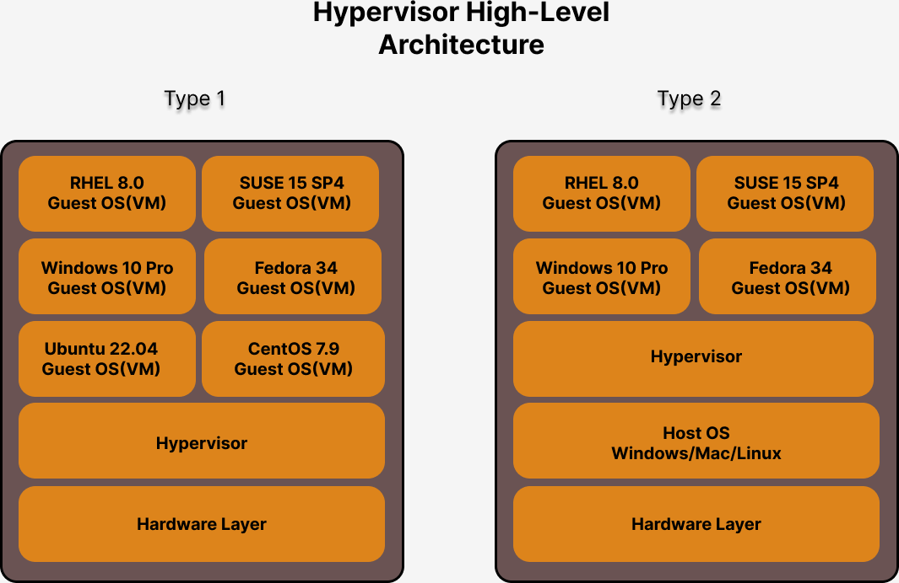

# Day 2

## ⛹️‍♂️ Lab - Compiling a Multi-module project
```
cd ~/devops-september-2022
git pull
cd Day2/multi-module-project
mvn clean install
```

Expected output
<pre>
[jegan@tektutor.org multi-module-project]$ <b>mvn clean install</b>
[INFO] Scanning for projects...
[INFO] ------------------------------------------------------------------------
[INFO] Reactor Build Order:
[INFO] 
[INFO] crm                                                                [pom]
[INFO] frontend                                                           [jar]
[INFO] business-layer                                                     [jar]
[INFO] data-access-layer                                                  [jar]
[INFO] main                                                               [jar]
[INFO] 
[INFO] --------------------------< org.tektutor:crm >--------------------------
[INFO] Building crm 1.0                                                   [1/5]
[INFO] --------------------------------[ pom ]---------------------------------
[INFO] 
[INFO] --- maven-clean-plugin:2.5:clean (default-clean) @ crm ---
[INFO] 
[INFO] --- maven-install-plugin:2.4:install (default-install) @ crm ---
[INFO] Installing /home/jegan/devops-september-2022/Day2/multi-module-project/pom.xml to /home/jegan/.m2/repository/org/tektutor/crm/1.0/crm-1.0.pom
[INFO] 
[INFO] -----------------------< org.tektutor:frontend >------------------------
[INFO] Building frontend 1.0                                              [2/5]
[INFO] --------------------------------[ jar ]---------------------------------
[INFO] 
[INFO] --- maven-clean-plugin:2.5:clean (default-clean) @ frontend ---
[INFO] 
[INFO] --- maven-resources-plugin:2.6:resources (default-resources) @ frontend ---
[WARNING] Using platform encoding (UTF-8 actually) to copy filtered resources, i.e. build is platform dependent!
[INFO] skip non existing resourceDirectory /home/jegan/devops-september-2022/Day2/multi-module-project/frontend/src/main/resources
[INFO] 
[INFO] --- maven-compiler-plugin:3.1:compile (default-compile) @ frontend ---
[INFO] Changes detected - recompiling the module!
[WARNING] File encoding has not been set, using platform encoding UTF-8, i.e. build is platform dependent!
[INFO] Compiling 1 source file to /home/jegan/devops-september-2022/Day2/multi-module-project/frontend/target/classes
[INFO] 
[INFO] --- maven-resources-plugin:2.6:testResources (default-testResources) @ frontend ---
[WARNING] Using platform encoding (UTF-8 actually) to copy filtered resources, i.e. build is platform dependent!
[INFO] skip non existing resourceDirectory /home/jegan/devops-september-2022/Day2/multi-module-project/frontend/src/test/resources
[INFO] 
[INFO] --- maven-compiler-plugin:3.1:testCompile (default-testCompile) @ frontend ---
[INFO] Changes detected - recompiling the module!
[WARNING] File encoding has not been set, using platform encoding UTF-8, i.e. build is platform dependent!
[INFO] Compiling 1 source file to /home/jegan/devops-september-2022/Day2/multi-module-project/frontend/target/test-classes
[INFO] 
[INFO] --- maven-surefire-plugin:2.12.4:test (default-test) @ frontend ---
[INFO] Surefire report directory: /home/jegan/devops-september-2022/Day2/multi-module-project/frontend/target/surefire-reports

-------------------------------------------------------
 T E S T S
-------------------------------------------------------
Running org.tektutor.FrontendTest
Tests run: 1, Failures: 0, Errors: 0, Skipped: 0, Time elapsed: 0.054 sec

Results :

Tests run: 1, Failures: 0, Errors: 0, Skipped: 0

[INFO] 
[INFO] --- maven-jar-plugin:2.4:jar (default-jar) @ frontend ---
[INFO] Building jar: /home/jegan/devops-september-2022/Day2/multi-module-project/frontend/target/frontend-1.0.jar
[INFO] 
[INFO] --- maven-install-plugin:2.4:install (default-install) @ frontend ---
[INFO] Installing /home/jegan/devops-september-2022/Day2/multi-module-project/frontend/target/frontend-1.0.jar to /home/jegan/.m2/repository/org/tektutor/frontend/1.0/frontend-1.0.jar
[INFO] Installing /home/jegan/devops-september-2022/Day2/multi-module-project/frontend/pom.xml to /home/jegan/.m2/repository/org/tektutor/frontend/1.0/frontend-1.0.pom
[INFO] 
[INFO] --------------------< org.tektutor:business-layer >---------------------
[INFO] Building business-layer 1.0                                        [3/5]
[INFO] --------------------------------[ jar ]---------------------------------
[INFO] 
[INFO] --- maven-clean-plugin:2.5:clean (default-clean) @ business-layer ---
[INFO] 
[INFO] --- maven-resources-plugin:2.6:resources (default-resources) @ business-layer ---
[WARNING] Using platform encoding (UTF-8 actually) to copy filtered resources, i.e. build is platform dependent!
[INFO] skip non existing resourceDirectory /home/jegan/devops-september-2022/Day2/multi-module-project/business-layer/src/main/resources
[INFO] 
[INFO] --- maven-compiler-plugin:3.1:compile (default-compile) @ business-layer ---
[INFO] Changes detected - recompiling the module!
[WARNING] File encoding has not been set, using platform encoding UTF-8, i.e. build is platform dependent!
[INFO] Compiling 1 source file to /home/jegan/devops-september-2022/Day2/multi-module-project/business-layer/target/classes
[INFO] 
[INFO] --- maven-resources-plugin:2.6:testResources (default-testResources) @ business-layer ---
[WARNING] Using platform encoding (UTF-8 actually) to copy filtered resources, i.e. build is platform dependent!
[INFO] skip non existing resourceDirectory /home/jegan/devops-september-2022/Day2/multi-module-project/business-layer/src/test/resources
[INFO] 
[INFO] --- maven-compiler-plugin:3.1:testCompile (default-testCompile) @ business-layer ---
[INFO] Changes detected - recompiling the module!
[WARNING] File encoding has not been set, using platform encoding UTF-8, i.e. build is platform dependent!
[INFO] Compiling 1 source file to /home/jegan/devops-september-2022/Day2/multi-module-project/business-layer/target/test-classes
[INFO] 
[INFO] --- maven-surefire-plugin:2.12.4:test (default-test) @ business-layer ---
[INFO] Surefire report directory: /home/jegan/devops-september-2022/Day2/multi-module-project/business-layer/target/surefire-reports

-------------------------------------------------------
 T E S T S
-------------------------------------------------------
Running org.tektutor.BusinessLayerTest
Tests run: 1, Failures: 0, Errors: 0, Skipped: 0, Time elapsed: 0.059 sec

Results :

Tests run: 1, Failures: 0, Errors: 0, Skipped: 0

[INFO] 
[INFO] --- maven-jar-plugin:2.4:jar (default-jar) @ business-layer ---
[INFO] Building jar: /home/jegan/devops-september-2022/Day2/multi-module-project/business-layer/target/business-layer-1.0.jar
[INFO] 
[INFO] --- maven-install-plugin:2.4:install (default-install) @ business-layer ---
[INFO] Installing /home/jegan/devops-september-2022/Day2/multi-module-project/business-layer/target/business-layer-1.0.jar to /home/jegan/.m2/repository/org/tektutor/business-layer/1.0/business-layer-1.0.jar
[INFO] Installing /home/jegan/devops-september-2022/Day2/multi-module-project/business-layer/pom.xml to /home/jegan/.m2/repository/org/tektutor/business-layer/1.0/business-layer-1.0.pom
[INFO] 
[INFO] -------------------< org.tektutor:data-access-layer >-------------------
[INFO] Building data-access-layer 1.0                                     [4/5]
[INFO] --------------------------------[ jar ]---------------------------------
[INFO] 
[INFO] --- maven-clean-plugin:2.5:clean (default-clean) @ data-access-layer ---
[INFO] 
[INFO] --- maven-resources-plugin:2.6:resources (default-resources) @ data-access-layer ---
[WARNING] Using platform encoding (UTF-8 actually) to copy filtered resources, i.e. build is platform dependent!
[INFO] skip non existing resourceDirectory /home/jegan/devops-september-2022/Day2/multi-module-project/data-access-layer/src/main/resources
[INFO] 
[INFO] --- maven-compiler-plugin:3.1:compile (default-compile) @ data-access-layer ---
[INFO] Changes detected - recompiling the module!
[WARNING] File encoding has not been set, using platform encoding UTF-8, i.e. build is platform dependent!
[INFO] Compiling 1 source file to /home/jegan/devops-september-2022/Day2/multi-module-project/data-access-layer/target/classes
[INFO] 
[INFO] --- maven-resources-plugin:2.6:testResources (default-testResources) @ data-access-layer ---
[WARNING] Using platform encoding (UTF-8 actually) to copy filtered resources, i.e. build is platform dependent!
[INFO] skip non existing resourceDirectory /home/jegan/devops-september-2022/Day2/multi-module-project/data-access-layer/src/test/resources
[INFO] 
[INFO] --- maven-compiler-plugin:3.1:testCompile (default-testCompile) @ data-access-layer ---
[INFO] Changes detected - recompiling the module!
[WARNING] File encoding has not been set, using platform encoding UTF-8, i.e. build is platform dependent!
[INFO] Compiling 1 source file to /home/jegan/devops-september-2022/Day2/multi-module-project/data-access-layer/target/test-classes
[INFO] 
[INFO] --- maven-surefire-plugin:2.12.4:test (default-test) @ data-access-layer ---
[INFO] Surefire report directory: /home/jegan/devops-september-2022/Day2/multi-module-project/data-access-layer/target/surefire-reports

-------------------------------------------------------
 T E S T S
-------------------------------------------------------
Running org.tektutor.DataAccessLayerTest
Tests run: 1, Failures: 0, Errors: 0, Skipped: 0, Time elapsed: 0.053 sec

Results :

Tests run: 1, Failures: 0, Errors: 0, Skipped: 0

[INFO] 
[INFO] --- maven-jar-plugin:2.4:jar (default-jar) @ data-access-layer ---
[INFO] Building jar: /home/jegan/devops-september-2022/Day2/multi-module-project/data-access-layer/target/data-access-layer-1.0.jar
[INFO] 
[INFO] --- maven-install-plugin:2.4:install (default-install) @ data-access-layer ---
[INFO] Installing /home/jegan/devops-september-2022/Day2/multi-module-project/data-access-layer/target/data-access-layer-1.0.jar to /home/jegan/.m2/repository/org/tektutor/data-access-layer/1.0/data-access-layer-1.0.jar
[INFO] Installing /home/jegan/devops-september-2022/Day2/multi-module-project/data-access-layer/pom.xml to /home/jegan/.m2/repository/org/tektutor/data-access-layer/1.0/data-access-layer-1.0.pom
[INFO] 
[INFO] -------------------------< org.tektutor:main >--------------------------
[INFO] Building main 1.0                                                  [5/5]
[INFO] --------------------------------[ jar ]---------------------------------
[INFO] 
[INFO] --- maven-clean-plugin:2.5:clean (default-clean) @ main ---
[INFO] 
[INFO] --- maven-resources-plugin:2.6:resources (default-resources) @ main ---
[WARNING] Using platform encoding (UTF-8 actually) to copy filtered resources, i.e. build is platform dependent!
[INFO] skip non existing resourceDirectory /home/jegan/devops-september-2022/Day2/multi-module-project/main/src/main/resources
[INFO] 
[INFO] --- maven-compiler-plugin:3.1:compile (default-compile) @ main ---
[INFO] Changes detected - recompiling the module!
[WARNING] File encoding has not been set, using platform encoding UTF-8, i.e. build is platform dependent!
[INFO] Compiling 1 source file to /home/jegan/devops-september-2022/Day2/multi-module-project/main/target/classes
[INFO] 
[INFO] --- maven-resources-plugin:2.6:testResources (default-testResources) @ main ---
[WARNING] Using platform encoding (UTF-8 actually) to copy filtered resources, i.e. build is platform dependent!
[INFO] skip non existing resourceDirectory /home/jegan/devops-september-2022/Day2/multi-module-project/main/src/test/resources
[INFO] 
[INFO] --- maven-compiler-plugin:3.1:testCompile (default-testCompile) @ main ---
[INFO] Changes detected - recompiling the module!
[WARNING] File encoding has not been set, using platform encoding UTF-8, i.e. build is platform dependent!
[INFO] Compiling 1 source file to /home/jegan/devops-september-2022/Day2/multi-module-project/main/target/test-classes
[INFO] 
[INFO] --- maven-surefire-plugin:2.12.4:test (default-test) @ main ---
[INFO] Surefire report directory: /home/jegan/devops-september-2022/Day2/multi-module-project/main/target/surefire-reports

-------------------------------------------------------
 T E S T S
-------------------------------------------------------
Running org.tektutor.MainTest
Tests run: 1, Failures: 0, Errors: 0, Skipped: 0, Time elapsed: 0.05 sec

Results :

Tests run: 1, Failures: 0, Errors: 0, Skipped: 0

[INFO] 
[INFO] --- maven-jar-plugin:2.4:jar (default-jar) @ main ---
[INFO] Building jar: /home/jegan/devops-september-2022/Day2/multi-module-project/main/target/main-1.0.jar
[INFO] 
[INFO] --- maven-install-plugin:2.4:install (default-install) @ main ---
[INFO] Installing /home/jegan/devops-september-2022/Day2/multi-module-project/main/target/main-1.0.jar to /home/jegan/.m2/repository/org/tektutor/main/1.0/main-1.0.jar
[INFO] Installing /home/jegan/devops-september-2022/Day2/multi-module-project/main/pom.xml to /home/jegan/.m2/repository/org/tektutor/main/1.0/main-1.0.pom
[INFO] ------------------------------------------------------------------------
[INFO] Reactor Summary for crm 1.0:
[INFO] 
[INFO] crm ................................................ SUCCESS [  0.276 s]
[INFO] frontend ........................................... SUCCESS [  1.676 s]
[INFO] business-layer ..................................... SUCCESS [  0.371 s]
[INFO] data-access-layer .................................. SUCCESS [  0.361 s]
[INFO] main ............................................... SUCCESS [  0.372 s]
[INFO] ------------------------------------------------------------------------
[INFO] BUILD SUCCESS
[INFO] ------------------------------------------------------------------------
[INFO] Total time:  3.173 s
[INFO] Finished at: 2022-09-26T22:32:07-07:00
[INFO] ------------------------------------------------------------------------
</pre>

## ⛹️‍♂️ Lab - Maven Profile
```
cd ~/devops-september-2022
git pull
cd Day2/profiles

mvn test -P test
```

Expected output
<pre>

</pre>

## Hypervisor
- aka virtualization technology
- heavy weight Virtualization
   - Guest Operating System (Virtual Machine)
      - they need to allocated dedicated hardware resources 
         - CPU Cores
         - RAM
         - Hard Disk Storage
- its a combination of hardware & software technology
- General Purpose Processors (x86_64 bit Processor)
   - AMD
     - AMD-V (Virtualization Feature)
   - Intel
     - VT-X (Virtualization Feature)

- Two types
  1. Type 1 ( Bare Metal Hypervisors )
     - example VMWare vSphere/vCenter
     - Microsoft Hyper-V
  2. Type 2
     - Example
       VMWare 
         - Fusion (Mac OS-X)
         - Workstation ( Windows/Linux/Mac )
       Oracle
         - VirtualBox (Free - Windows/Linux/Mac)
       
       
## Container Technology
- application virtualization technology
- each container is nothing but an application process
- each container runs in its own namespace
- every container has got its own network stack (7 OSI Layers)
- container is not an Operating System
- every container get its own IP and file system
- containers looks like a Virtual Machine but one container can host/run only one application
- every container gets its own ports ( 0 - 65535 ports )
- hence technically it is possible to run 10 tomcat web server on the same machine all listing at port 8080
- containers don't need to be allocated with dedicated CPU, RAM or Storage
- container technology is ligh weight virtualization technology
- containers depends on the OS Kernel on the Host OS where containers are running for any OS feature
- all containers running on the same desktop/laptop/workstation/servers share the underlying hardwares resources available on that machine

## What is Container Runtime?
- Container runtime helps managing containers
  - creating a container
  - starting a container
  - stoping a container
  - restarting a container
  - abort/kill a container
  - delete a container
- Example
  - runC is a Container Runtime

## What is Container Engine?
- Container Engine depends on Container Runtime to manage containers
- Container Engine provides easy to use user-friendly commands to manage containers and images
- Container Engine depends on other tools to manage images just like how they depend on Container Runtime
- end-users like us will only use Container Engine as they are easy to use, but they internally depends on other tools to get the job done
- Example
  - Docker is a Container Engine that depends on runC Container Runtime
  - Podman is a Container Engine that depends on CRI-O Container Runtime

## Linux Kernel Features that enable Container Technology
1. Namespace
   - helps in isolating one container from accessing other container resources
   - just like how Hypervisors isolate one Virtual Machine from access other Virtual Machine resources
2. Control Group (CGroup)
   - we should be able to apply resource quota restrictions for each container optionally
   - For instance
      - we could restrict a container to use maximum 25% CPU ( in a system with 4 core - it can only 1 core )
      - we could restrict a container to use upto 1GB RAM

# Docker
- is one of the Container Engines
- Docker is developed in Go Programming Language by Docker Inc organization
- Docker comes in 2 flavours
  1. Community Edition (CE) - opensource or personal or non-commercial use
  2. Enterprise Edition (EE) - Commercial use

## What is Docker Hub?
- a website that has many Docker Images
- the website is managed by Docker Inc organization which developed Docker
- any one would be able to contribute i.e push their custom images to Docker Hub for public use

## What are Docker Images?
- a blueprint of a container
- we can use existing docker images from Docker Hub
- in certain scenarios, you may look for container images with specific tools pre-installed. But it is impossible to find every tool that projects need in a image that comes from Docker Hub. In such cases, you can pick an Docker Hub that has most of the tools you were looking for, and prepare a custom Docker image by installing all necessary tools.
- containers are created from Docker Image
- From one Container any number of Containers can be created

## What is a Docker Container?
- an running instance of a Docker Image
- tools installed on the Docker Image are available for use in Container
- one container typically runs one application

## Docker Registries
- Docker Registry has many collection of Docker Images
- Docker supports 3 types of Registries
  1. Local Registry ( /var/lib/docker folder on your system )
  2. Private Registry ( can be setup using JFrog Artifactory or Sonatype Nexus )
  3. Remote Registry ( Docker Hub website )

## Docker Alternatives
- LXC
- Containerd
- Podman

## What kind of applications can be containerized?
- We can run any blocking blocking applications
- blocking in the sense, applications that keeps running forever
- For example
   - unix/linux shell
   - Web Servers
   - App Servers
   - DB Servers
   - SOAP API
   - REST API
   - Microservice
   
   
## Hypervisor High Level Architecture


## Docker High Level Architecture


## ⛹️‍♂️ Lab - Finding the docker version
```
docker --version
```

Expected output
<pre>
[jegan@tektutor.org Day2]$ <b>docker --version</b>
Docker version 20.10.18, build b40c2f6
</pre>

## ⛹️‍♂️ Lab - Troubleshooting Docker permission denied errors
```
newgrp docker
docker images
```

## ⛹️‍♂️ Lab - Finding more information about your docker setup
```
docker info
```

Expected output
<pre>
[jegan@tektutor.org hello]$ <b>docker info</b>
Client:
 Context:    default
 Debug Mode: false
 Plugins:
  app: Docker App (Docker Inc., v0.9.1-beta3)
  buildx: Docker Buildx (Docker Inc., v0.9.1-docker)
  compose: Docker Compose (Docker Inc., v2.10.2)
  scan: Docker Scan (Docker Inc., v0.17.0)

Server:
 Containers: 2
  Running: 2
  Paused: 0
  Stopped: 0
 Images: 5
 Server Version: 20.10.18
 Storage Driver: overlay2
  Backing Filesystem: xfs
  Supports d_type: true
  Native Overlay Diff: true
  userxattr: false
 Logging Driver: json-file
 Cgroup Driver: cgroupfs
 Cgroup Version: 1
 Plugins:
  Volume: local
  Network: bridge host ipvlan macvlan null overlay
  Log: awslogs fluentd gcplogs gelf journald json-file local logentries splunk syslog
 Swarm: inactive
 Runtimes: io.containerd.runc.v2 io.containerd.runtime.v1.linux runc
 Default Runtime: runc
 Init Binary: docker-init
 containerd version: 9cd3357b7fd7218e4aec3eae239db1f68a5a6ec6
 runc version: v1.1.4-0-g5fd4c4d
 init version: de40ad0
 Security Options:
  seccomp
   Profile: default
 Kernel Version: 3.10.0-1160.el7.x86_64
 Operating System: CentOS Linux 7 (Core)
 OSType: linux
 Architecture: x86_64
 CPUs: 4
 Total Memory: 15.49GiB
 Name: tektutor.org
 ID: I6RI:7BJT:YI4Y:3WM4:MWSL:3JN7:ENZB:D3PP:AQA6:JCZJ:WFLT:7WZI
 <b>Docker Root Dir: /var/lib/docker</b>
 Debug Mode: false
 Registry: https://index.docker.io/v1/
 Labels:
 Experimental: false
 Insecure Registries:
  127.0.0.0/8
 Live Restore Enabled: false
</pre>

## ⛹️‍♂️ Lab - Listing Docker Images from your Local Docker Registry
```
docker images
```

Expected output
<pre>
[jegan@tektutor.org Day2]$ <b>docker images</b>
REPOSITORY                                TAG       IMAGE ID       CREATED       SIZE
mysql                                     latest    43fcfca0776d   12 days ago   449MB
docker.bintray.io/jfrog/artifactory-oss   latest    e7053142b08e   3 weeks ago   1.24GB
</pre>

## ⛹️‍♂️ Lab - Downloading Docker Image from Docker Hub to Local Registry
```
docker pull hello-world:latest
```

Expected output
<pre>
[jegan@tektutor.org Day2]$ <b>docker pull hello-world:latest</b>
latest: Pulling from library/hello-world
2db29710123e: Pull complete 
Digest: sha256:62af9efd515a25f84961b70f973a798d2eca956b1b2b026d0a4a63a3b0b6a3f2
Status: Downloaded newer image for hello-world:latest
docker.io/library/hello-world:latest
[jegan@tektutor.org Day2]$ docker images
REPOSITORY                                TAG       IMAGE ID       CREATED         SIZE
mysql                                     latest    43fcfca0776d   12 days ago     449MB
docker.bintray.io/jfrog/artifactory-oss   latest    e7053142b08e   3 weeks ago     1.24GB
hello-world                               latest    feb5d9fea6a5   12 months ago   13.3kB
</pre>

## ⛹️‍♂️ Lab - Deleting a Docker Image from Local Registry
```
docker rmi hello-world:latest
```

Expected output
<pre>
[jegan@tektutor.org Day2]$ <b>docker rmi hello-world:latest</b>
Untagged: hello-world:latest
Untagged: hello-world@sha256:62af9efd515a25f84961b70f973a798d2eca956b1b2b026d0a4a63a3b0b6a3f2
Deleted: sha256:feb5d9fea6a5e9606aa995e879d862b825965ba48de054caab5ef356dc6b3412
Deleted: sha256:e07ee1baac5fae6a26f30cabfe54a36d3402f96afda318fe0a96cec4ca393359
</pre>

## ⛹️‍♂️ Lab - Creating your first docker container
```
docker run hello-world:latest
```

Expected output
<pre>
[jegan@tektutor.org Day2]$ <b>docker run hello-world:latest</b>
Unable to find image 'hello-world:latest' locally
latest: Pulling from library/hello-world
2db29710123e: Pull complete 
Digest: sha256:62af9efd515a25f84961b70f973a798d2eca956b1b2b026d0a4a63a3b0b6a3f2
Status: Downloaded newer image for hello-world:latest

Hello from Docker!
This message shows that your installation appears to be working correctly.

To generate this message, Docker took the following steps:
 1. The Docker client contacted the Docker daemon.
 2. The Docker daemon pulled the "hello-world" image from the Docker Hub.
    (amd64)
 3. The Docker daemon created a new container from that image which runs the
    executable that produces the output you are currently reading.
 4. The Docker daemon streamed that output to the Docker client, which sent it
    to your terminal.

To try something more ambitious, you can run an Ubuntu container with:
 $ docker run -it ubuntu bash

Share images, automate workflows, and more with a free Docker ID:
 https://hub.docker.com/

For more examples and ideas, visit:
 https://docs.docker.com/get-started/
</pre>


## ⛹️‍♂️ Lab - Listing currently running containers
```
docker ps
```

Expected output
<pre>
[jegan@tektutor.org Day2]$ <b>docker ps</b>
CONTAINER ID   IMAGE                                            COMMAND                  CREATED        STATUS        PORTS                                                           NAMES
ad3588fe2258   mysql:latest                                     "docker-entrypoint.s…"   20 hours ago   Up 20 hours   3306/tcp, 33060/tcp                                             mysql
1cbbabada110   docker.bintray.io/jfrog/artifactory-oss:latest   "/entrypoint-artifac…"   21 hours ago   Up 21 hours   0.0.0.0:8081-8082->8081-8082/tcp, :::8081-8082->8081-8082/tcp   artifactory
</pre>

## ⛹️‍♂️ Lab - Listing all containers including the one that exited
```
docker ps -a
```

Expected output
<pre>
[jegan@tektutor.org Day2]$ docker ps -a
CONTAINER ID   IMAGE                                            COMMAND                  CREATED         STATUS                     PORTS                                                           NAMES
<b>9db646569c40   hello-world:latest                               "/hello"                 2 minutes ago   Exited (0) 2 minutes ago                                                                   dazzling_lalande</b>
ad3588fe2258   mysql:latest                                     "docker-entrypoint.s…"   20 hours ago    Up 20 hours                3306/tcp, 33060/tcp                                             mysql
1cbbabada110   docker.bintray.io/jfrog/artifactory-oss:latest   "/entrypoint-artifac…"   21 hours ago    Up 21 hours                0.0.0.0:8081-8082->8081-8082/tcp, :::8081-8082->8081-8082/tcp   artifactory
</pre>


## ⛹️‍♂️ Lab - Creating a container and running it in background
```
docker run -dit --name ubuntu1 --hostname ubuntu1 ubuntu:16.04 /bin/bash
docker ps
```

Expected output
<pre>
[jegan@tektutor.org Day2]$ <b>docker run -dit --name ubuntu1 --hostname ubuntu1 ubuntu:16.04 /bin/bash</b>
Unable to find image 'ubuntu:16.04' locally
16.04: Pulling from library/ubuntu
58690f9b18fc: Pull complete 
b51569e7c507: Pull complete 
da8ef40b9eca: Pull complete 
fb15d46c38dc: Pull complete 
Digest: sha256:91bd29a464fdabfcf44e29e1f2a5f213c6dfa750b6290e40dd6998ac79da3c41
Status: Downloaded newer image for ubuntu:16.04
517846b24a6a775d9e192d41cb68a0f74d43062fe321525d1e2ceb8c2e9378e6
[jegan@tektutor.org Day2]$ <b>docker ps</b>
CONTAINER ID   IMAGE                                            COMMAND                  CREATED         STATUS         PORTS                                                           NAMES
<b>517846b24a6a   ubuntu:16.04                                     "/bin/bash"              6 seconds ago   Up 5 seconds                                                                   ubuntu1</b>
ad3588fe2258   mysql:latest                                     "docker-entrypoint.s…"   20 hours ago    Up 20 hours    3306/tcp, 33060/tcp                                             mysql
1cbbabada110   docker.bintray.io/jfrog/artifactory-oss:latest   "/entrypoint-artifac…"   21 hours ago    Up 21 hours    0.0.0.0:8081-8082->8081-8082/tcp, :::8081-8082->8081-8082/tcp   artifactory
</pre>

## ⛹️‍♂️ Lab - Opening a shell inside a running container
```
docker ps
```

Expected output
<pre>
[jegan@tektutor.org Day2]$ <b>docker ps</b>
CONTAINER ID   IMAGE                                            COMMAND                  CREATED         STATUS         PORTS                                                           NAMES
<b>517846b24a6a   ubuntu:16.04                                     "/bin/bash"              6 seconds ago   Up 5 seconds                                                                   ubuntu1</b>
ad3588fe2258   mysql:latest                                     "docker-entrypoint.s…"   20 hours ago    Up 20 hours    3306/tcp, 33060/tcp                                             mysql
1cbbabada110   docker.bintray.io/jfrog/artifactory-oss:latest   "/entrypoint-artifac…"   21 hours ago    Up 21 hours    0.0.0.0:8081-8082->8081-8082/tcp, :::8081-8082->8081-8082/tcp   artifactory
[jegan@tektutor.org Day2]$ docker exec -it ubuntu1 /bin/bash
root@ubuntu1:/# <b>hostname</b>
ubuntu1
root@ubuntu1:/# <b>hostname -i</b>
172.17.0.4
root@ubuntu1:/# <b>ls</b>
bin  boot  dev  etc  home  lib  lib64  media  mnt  opt  proc  root  run  sbin  srv  sys  tmp  usr  var
root@ubuntu1:/# <b>exit</b>
exit
</pre>

## ⛹️‍♂️ Lab - Stopping a running container
```
docker ps
docker stop ubuntu1
docker ps
```

Expected output
<pre>
[jegan@tektutor.org Day2]$ <b>docker ps</b>
CONTAINER ID   IMAGE                                            COMMAND                  CREATED         STATUS         PORTS                                                           NAMES
<b>517846b24a6a   ubuntu:16.04                                     "/bin/bash"              6 minutes ago   Up 6 minutes                                                                   ubuntu1</b>
ad3588fe2258   mysql:latest                                     "docker-entrypoint.s…"   21 hours ago    Up 21 hours    3306/tcp, 33060/tcp                                             mysql
1cbbabada110   docker.bintray.io/jfrog/artifactory-oss:latest   "/entrypoint-artifac…"   21 hours ago    Up 21 hours    0.0.0.0:8081-8082->8081-8082/tcp, :::8081-8082->8081-8082/tcp   artifactory
[jegan@tektutor.org Day2]$ <b>docker stop ubuntu1</b>
ubuntu1
[jegan@tektutor.org Day2]$ <b>docker ps</b>
CONTAINER ID   IMAGE                                            COMMAND                  CREATED        STATUS        PORTS                                                           NAMES
ad3588fe2258   mysql:latest                                     "docker-entrypoint.s…"   21 hours ago   Up 21 hours   3306/tcp, 33060/tcp                                             mysql
1cbbabada110   docker.bintray.io/jfrog/artifactory-oss:latest   "/entrypoint-artifac…"   21 hours ago   Up 21 hours   0.0.0.0:8081-8082->8081-8082/tcp, :::8081-8082->8081-8082/tcp   artifactory
</pre>

## ⛹️‍♂️ Lab - Starting an exited container
```
docker ps -a
docker start ubuntu1
docker ps
```

Expected output
<pre>
[jegan@tektutor.org Day2]$ <b>docker ps -a</b>
CONTAINER ID   IMAGE                                            COMMAND                  CREATED          STATUS                          PORTS                                                           NAMES
<b>517846b24a6a   ubuntu:16.04                                     "/bin/bash"              8 minutes ago    Exited (0) About a minute ago                                                                   ubuntu1</b>
9db646569c40   hello-world:latest                               "/hello"                 13 minutes ago   Exited (0) 13 minutes ago                                                                       dazzling_lalande
ad3588fe2258   mysql:latest                                     "docker-entrypoint.s…"   21 hours ago     Up 21 hours                     3306/tcp, 33060/tcp                                             mysql
1cbbabada110   docker.bintray.io/jfrog/artifactory-oss:latest   "/entrypoint-artifac…"   21 hours ago     Up 21 hours                     0.0.0.0:8081-8082->8081-8082/tcp, :::8081-8082->8081-8082/tcp   artifactory
[jegan@tektutor.org Day2]$ <b>docker start ubuntu1</b>
ubuntu1
[jegan@tektutor.org Day2]$ <b>docker ps</b>
CONTAINER ID   IMAGE                                            COMMAND                  CREATED         STATUS        PORTS                                                           NAMES
<b>517846b24a6a   ubuntu:16.04                                     "/bin/bash"              8 minutes ago   Up 1 second                                                                   ubuntu1</b>
ad3588fe2258   mysql:latest                                     "docker-entrypoint.s…"   21 hours ago    Up 21 hours   3306/tcp, 33060/tcp                                             mysql
1cbbabada110   docker.bintray.io/jfrog/artifactory-oss:latest   "/entrypoint-artifac…"   21 hours ago    Up 21 hours   0.0.0.0:8081-8082->8081-8082/tcp, :::8081-8082->8081-8082/tcp   artifactory
</pre>

## ⛹️‍♂️ Lab - Restarting a container
```
docker restart ubuntu1
docker ps
```

Expected output
<pre>
[jegan@tektutor.org Day2]$ <b>docker restart ubuntu1</b>
ubuntu1
[jegan@tektutor.org Day2]$ <b>docker ps</b>
CONTAINER ID   IMAGE                                            COMMAND                  CREATED          STATUS        PORTS                                                           NAMES
<b>517846b24a6a   ubuntu:16.04                                     "/bin/bash"              10 minutes ago   Up 1 second                                                                   ubuntu1</b>
ad3588fe2258   mysql:latest                                     "docker-entrypoint.s…"   21 hours ago     Up 21 hours   3306/tcp, 33060/tcp                                             mysql
1cbbabada110   docker.bintray.io/jfrog/artifactory-oss:latest   "/entrypoint-artifac…"   21 hours ago     Up 21 hours   0.0.0.0:8081-8082->8081-8082/tcp, :::8081-8082->8081-8082/tcp   artifactory
</pre>

## ⛹️‍♂️ Lab - Delete a running container graciously
```
docker stop ubuntu1
docker rm ubuntu1
```

Expected output
<pre>
jegan@tektutor.org Day2]$ <b>docker rm ubuntu1</b>
Error response from daemon: You cannot remove a running container 517846b24a6a775d9e192d41cb68a0f74d43062fe321525d1e2ceb8c2e9378e6. Stop the container before attempting removal or force remove
[jegan@tektutor.org Day2]$ <b>docker stop ubuntu1</b>
ubuntu1
[jegan@tektutor.org Day2]$ <b>docker rm ubuntu1</b>
ubuntu1
[jegan@tektutor.org Day2]$ <b>docker ps -a</b>
CONTAINER ID   IMAGE                                            COMMAND                  CREATED          STATUS                      PORTS                                                           NAMES
9db646569c40   hello-world:latest                               "/hello"                 18 minutes ago   Exited (0) 18 minutes ago                                                                   dazzling_lalande
ad3588fe2258   mysql:latest                                     "docker-entrypoint.s…"   21 hours ago     Up 21 hours                 3306/tcp, 33060/tcp                                             mysql
1cbbabada110   docker.bintray.io/jfrog/artifactory-oss:latest   "/entrypoint-artifac…"   21 hours ago     Up 21 hours                 0.0.0.0:8081-8082->8081-8082/tcp, :::8081-8082->8081-8082/tcp   artifactory
</pre>

## ⛹️‍♂️ Lab - Deleting a running container forcibly without stopped it first
```
docker rm -f mysql
```

Expected output
<pre>
[jegan@tektutor.org Day2]$ <b>docker ps </b>
CONTAINER ID   IMAGE                                            COMMAND                  CREATED        STATUS        PORTS                                                           NAMES
ad3588fe2258   mysql:latest                                     "docker-entrypoint.s…"   21 hours ago   Up 21 hours   3306/tcp, 33060/tcp                                             mysql
1cbbabada110   docker.bintray.io/jfrog/artifactory-oss:latest   "/entrypoint-artifac…"   21 hours ago   Up 21 hours   0.0.0.0:8081-8082->8081-8082/tcp, :::8081-8082->8081-8082/tcp   artifactory
[jegan@tektutor.org Day2]$ <b>docker rm -f mysql</b>
mysql
</pre>

## ⛹️‍♂️ Lab - Deleting multiple containers with a single command
```
docker ps -a
docker rm -f artifactory dazzling_lalande
```

Expected output
<pre>
[jegan@tektutor.org Day2]$ <b>docker ps -a</b>
CONTAINER ID   IMAGE                                            COMMAND                  CREATED          STATUS                      PORTS                                                           NAMES
9db646569c40   hello-world:latest                               "/hello"                 30 minutes ago   Exited (0) 30 minutes ago                                                                   dazzling_lalande
1cbbabada110   docker.bintray.io/jfrog/artifactory-oss:latest   "/entrypoint-artifac…"   21 hours ago     Up 21 hours                 0.0.0.0:8081-8082->8081-8082/tcp, :::8081-8082->8081-8082/tcp   artifactory
[jegan@tektutor.org Day2]$ <b>docker rm -f artifactory dazzling_lalande</b>
artifactory
dazzling_lalande
</pre>

## ⛹️‍♂️ Lab - Creating nginx web server containers
```
docker ps -a
docker run -d --name nginx1 --hostname nginx1 nginx:latest
docker run -d --name nginx2 --hostname nginx2 nginx:latest
docker run -d --name nginx3 --hostname nginx3 nginx:latest
docker ps
```

Expected output
<pre>
[jegan@tektutor.org Day2]$ docker ps -a
CONTAINER ID   IMAGE     COMMAND   CREATED   STATUS    PORTS     NAMES
[jegan@tektutor.org Day2]$ <b>docker run -d --name nginx1 --hostname nginx1 nginx:latest</b>
Unable to find image 'nginx:latest' locally
latest: Pulling from library/nginx
31b3f1ad4ce1: Pull complete 
fd42b079d0f8: Pull complete 
30585fbbebc6: Pull complete 
18f4ffdd25f4: Pull complete 
9dc932c8fba2: Pull complete 
600c24b8ba39: Pull complete 
Digest: sha256:0b970013351304af46f322da1263516b188318682b2ab1091862497591189ff1
Status: Downloaded newer image for nginx:latest
b201614504ec4ac2e0617da9ecce1648cc858229a05808ca4497206bfcc51e5d
[jegan@tektutor.org Day2]$ <b>docker run -d --name nginx2 --hostname nginx2 nginx:latest</b>
bf3c30180fb315daf00019831ee688ef9a41e3588f56c4235d0491c34e12a34b
[jegan@tektutor.org Day2]$ <b>docker run -d --name nginx3 --hostname nginx3 nginx:latest</b>
6f65a1fbc158a9e4cacfdc8e2916885a82991858cfe032e39f80b19bec64feb3
[jegan@tektutor.org Day2]$ <b>docker ps</b>
CONTAINER ID   IMAGE          COMMAND                  CREATED          STATUS          PORTS     NAMES
6f65a1fbc158   nginx:latest   "/docker-entrypoint.…"   2 seconds ago    Up 1 second     80/tcp    nginx3
bf3c30180fb3   nginx:latest   "/docker-entrypoint.…"   7 seconds ago    Up 6 seconds    80/tcp    nginx2
b201614504ec   nginx:latest   "/docker-entrypoint.…"   13 seconds ago   Up 11 seconds   80/tcp    nginx1
</pre>

## ⛹️‍♂️ Lab - Finding the IP Address of a running container
```
docker inspect nginx1 | grep IPA
docker inspect nginx2 | grep IPA
docker inspect nginx3 | grep IPA
```

Expected output
<pre>
[jegan@tektutor.org Day2]$ <b>docker inspect nginx1 | grep IPA</b>
            "SecondaryIPAddresses": null,
            "IPAddress": "172.17.0.2",
                    "IPAMConfig": null,
                    "IPAddress": "172.17.0.2",
[jegan@tektutor.org Day2]$ <b>docker inspect nginx2 | grep IPA</b>
            "SecondaryIPAddresses": null,
            "IPAddress": "172.17.0.3",
                    "IPAMConfig": null,
                    "IPAddress": "172.17.0.3",
[jegan@tektutor.org Day2]$ <b>docker inspect nginx3 | grep IPA</b>
            "SecondaryIPAddresses": null,
            "IPAddress": "172.17.0.4",
                    "IPAMConfig": null,
                    "IPAddress": "172.17.0.4",
</pre>

## ⛹️‍♂️ Lab - Using plain docker command to retrieve IP Address of containers
```
docker inspect nginx1
docker inspect -f "{{.NetworkSettings.IPAddress}}" nginx1
docker inspect -f "{{.NetworkSettings.IPAddress}}" nginx2
docker inspect -f "{{.NetworkSettings.IPAddress}}" nginx3
```

Expected output
<pre>
[jegan@tektutor.org Day2]$ <b>docker inspect  nginx1</b>
[
    {
        "Id": "b201614504ec4ac2e0617da9ecce1648cc858229a05808ca4497206bfcc51e5d",
        "Created": "2022-09-27T09:21:13.505279382Z",
        "Path": "/docker-entrypoint.sh",
        "Args": [
            "nginx",
            "-g",
            "daemon off;"
        ],
        "State": {
            "Status": "running",
            "Running": true,
            "Paused": false,
            "Restarting": false,
            "OOMKilled": false,
            "Dead": false,
            "Pid": 66593,
            "ExitCode": 0,
            "Error": "",
            "StartedAt": "2022-09-27T09:21:14.136333208Z",
            "FinishedAt": "0001-01-01T00:00:00Z"
        },
        "Image": "sha256:2d389e545974d4a93ebdef09b650753a55f72d1ab4518d17a30c0e1b3e297444",
        "ResolvConfPath": "/var/lib/docker/containers/b201614504ec4ac2e0617da9ecce1648cc858229a05808ca4497206bfcc51e5d/resolv.conf",
        "HostnamePath": "/var/lib/docker/containers/b201614504ec4ac2e0617da9ecce1648cc858229a05808ca4497206bfcc51e5d/hostname",
        "HostsPath": "/var/lib/docker/containers/b201614504ec4ac2e0617da9ecce1648cc858229a05808ca4497206bfcc51e5d/hosts",
        "LogPath": "/var/lib/docker/containers/b201614504ec4ac2e0617da9ecce1648cc858229a05808ca4497206bfcc51e5d/b201614504ec4ac2e0617da9ecce1648cc858229a05808ca4497206bfcc51e5d-json.log",
        "Name": "/nginx1",
        "RestartCount": 0,
        "Driver": "overlay2",
        "Platform": "linux",
        "MountLabel": "",
        "ProcessLabel": "",
        "AppArmorProfile": "",
        "ExecIDs": null,
        "HostConfig": {
            "Binds": null,
            "ContainerIDFile": "",
            "LogConfig": {
                "Type": "json-file",
                "Config": {}
            },
            "NetworkMode": "default",
            "PortBindings": {},
            "RestartPolicy": {
                "Name": "no",
                "MaximumRetryCount": 0
            },
            "AutoRemove": false,
            "VolumeDriver": "",
            "VolumesFrom": null,
            "CapAdd": null,
            "CapDrop": null,
            "CgroupnsMode": "host",
            "Dns": [],
            "DnsOptions": [],
            "DnsSearch": [],
            "ExtraHosts": null,
            "GroupAdd": null,
            "IpcMode": "private",
            "Cgroup": "",
            "Links": null,
            "OomScoreAdj": 0,
            "PidMode": "",
            "Privileged": false,
            "PublishAllPorts": false,
            "ReadonlyRootfs": false,
            "SecurityOpt": null,
            "UTSMode": "",
            "UsernsMode": "",
            "ShmSize": 67108864,
            "Runtime": "runc",
            "ConsoleSize": [
                0,
                0
            ],
            "Isolation": "",
            "CpuShares": 0,
            "Memory": 0,
            "NanoCpus": 0,
            "CgroupParent": "",
            "BlkioWeight": 0,
            "BlkioWeightDevice": [],
            "BlkioDeviceReadBps": null,
            "BlkioDeviceWriteBps": null,
            "BlkioDeviceReadIOps": null,
            "BlkioDeviceWriteIOps": null,
            "CpuPeriod": 0,
            "CpuQuota": 0,
            "CpuRealtimePeriod": 0,
            "CpuRealtimeRuntime": 0,
            "CpusetCpus": "",
            "CpusetMems": "",
            "Devices": [],
            "DeviceCgroupRules": null,
            "DeviceRequests": null,
            "KernelMemory": 0,
            "KernelMemoryTCP": 0,
            "MemoryReservation": 0,
            "MemorySwap": 0,
            "MemorySwappiness": null,
            "OomKillDisable": false,
            "PidsLimit": null,
            "Ulimits": null,
            "CpuCount": 0,
            "CpuPercent": 0,
            "IOMaximumIOps": 0,
            "IOMaximumBandwidth": 0,
            "MaskedPaths": [
                "/proc/asound",
                "/proc/acpi",
                "/proc/kcore",
                "/proc/keys",
                "/proc/latency_stats",
                "/proc/timer_list",
                "/proc/timer_stats",
                "/proc/sched_debug",
                "/proc/scsi",
                "/sys/firmware"
            ],
            "ReadonlyPaths": [
                "/proc/bus",
                "/proc/fs",
                "/proc/irq",
                "/proc/sys",
                "/proc/sysrq-trigger"
            ]
        },
        "GraphDriver": {
            "Data": {
                "LowerDir": "/var/lib/docker/overlay2/b1479b13077d6a83ce871f6305555a562929c4571cc4644bb3c4e3099d0fdd8c-init/diff:/var/lib/docker/overlay2/9e20998c078108a8c0043704f13cd4e646d5c26f61ff83011b863b343dd1e027/diff:/var/lib/docker/overlay2/98e51cd56b07c3abdbe4cfa0d13dfd10e12fd862a5279a1f5c348bffcdea9b5f/diff:/var/lib/docker/overlay2/dabeeee8cd6e41547211fdb375593ff2b37b77877f35581ed0c5b9455ccceaa1/diff:/var/lib/docker/overlay2/2ac22d1fcf1682b799adce312922d18a065ec2abb8a193eeea3169f73c2081ba/diff:/var/lib/docker/overlay2/22bd8de480997242e098f97448f0897f6e3cf813f747a79286a07cf2cfc74721/diff:/var/lib/docker/overlay2/b8c6a8ec7e398bea514354e4004844e0b333838ea0c5be55ff9f4bd29abefc59/diff",
                "MergedDir": "/var/lib/docker/overlay2/b1479b13077d6a83ce871f6305555a562929c4571cc4644bb3c4e3099d0fdd8c/merged",
                "UpperDir": "/var/lib/docker/overlay2/b1479b13077d6a83ce871f6305555a562929c4571cc4644bb3c4e3099d0fdd8c/diff",
                "WorkDir": "/var/lib/docker/overlay2/b1479b13077d6a83ce871f6305555a562929c4571cc4644bb3c4e3099d0fdd8c/work"
            },
            "Name": "overlay2"
        },
        "Mounts": [],
        "Config": {
            "Hostname": "nginx1",
            "Domainname": "",
            "User": "",
            "AttachStdin": false,
            "AttachStdout": false,
            "AttachStderr": false,
            "ExposedPorts": {
                "80/tcp": {}
            },
            "Tty": false,
            "OpenStdin": false,
            "StdinOnce": false,
            "Env": [
                "PATH=/usr/local/sbin:/usr/local/bin:/usr/sbin:/usr/bin:/sbin:/bin",
                "NGINX_VERSION=1.23.1",
                "NJS_VERSION=0.7.6",
                "PKG_RELEASE=1~bullseye"
            ],
            "Cmd": [
                "nginx",
                "-g",
                "daemon off;"
            ],
            "Image": "nginx:latest",
            "Volumes": null,
            "WorkingDir": "",
            "Entrypoint": [
                "/docker-entrypoint.sh"
            ],
            "OnBuild": null,
            "Labels": {
                "maintainer": "NGINX Docker Maintainers <docker-maint@nginx.com>"
            },
            "StopSignal": "SIGQUIT"
        },
        "NetworkSettings": {
            "Bridge": "",
            "SandboxID": "af08bbbc315ab2848808a50329bf80a81b459cb9b415cae4952f5a0606fb2737",
            "HairpinMode": false,
            "LinkLocalIPv6Address": "",
            "LinkLocalIPv6PrefixLen": 0,
            "Ports": {
                "80/tcp": null
            },
            "SandboxKey": "/var/run/docker/netns/af08bbbc315a",
            "SecondaryIPAddresses": null,
            "SecondaryIPv6Addresses": null,
            "EndpointID": "3d7fa9d3b1a0c61409d516f0a59858b14e0c8927cd6a6161267c69ad6213ca21",
            "Gateway": "172.17.0.1",
            "GlobalIPv6Address": "",
            "GlobalIPv6PrefixLen": 0,
            "IPAddress": "172.17.0.2",
            "IPPrefixLen": 16,
            "IPv6Gateway": "",
            "MacAddress": "02:42:ac:11:00:02",
            "Networks": {
                "bridge": {
                    "IPAMConfig": null,
                    "Links": null,
                    "Aliases": null,
                    "NetworkID": "f46061f25a187198339756e85e6b13b0122b654484bd4098ed0892c7146f603b",
                    "EndpointID": "3d7fa9d3b1a0c61409d516f0a59858b14e0c8927cd6a6161267c69ad6213ca21",
                    "Gateway": "172.17.0.1",
                    "IPAddress": "172.17.0.2",
                    "IPPrefixLen": 16,
                    "IPv6Gateway": "",
                    "GlobalIPv6Address": "",
                    "GlobalIPv6PrefixLen": 0,
                    "MacAddress": "02:42:ac:11:00:02",
                    "DriverOpts": null
                }
            }
        }
    }
]
[jegan@tektutor.org Day2]$ <b>docker inspect -f "{{.NetworkSettings.IPAddress}}" nginx1</b>
172.17.0.2
[jegan@tektutor.org Day2]$ <b>docker inspect -f "{{.NetworkSettings.IPAddress}}" nginx2</b>
172.17.0.3
[jegan@tektutor.org Day2]$ <b>docker inspect -f "{{.NetworkSettings.IPAddress}}" nginx3</b>
172.17.0.4
</pre>

## ⛹️‍♂️ Lab - Retrieving Mac Address of a container
```
docker inspect -f "{{.NetworkSettings.MacAddress}}" nginx3
```

Expected output
<pre>
[jegan@tektutor.org Day2]$ <b>docker inspect -f "{{.NetworkSettings.MacAddress}}" nginx3</b>
02:42:ac:11:00:04
</pre>

## ⛹️‍♂️ Lab - IP Addresses assigned to containers are Private and dynamic IPs
```
docker inspect nginx1 | grep IPA
docker stop nginx1
docker run -d --name nginx4 --hostname nginx4 nginx:latest
docker inspect nginx4 | grep IPA
docker start nginx1
docker inspect nginx1 | grep IPA
```

Expected output
<pre>
[jegan@tektutor.org Day2]$ <b>docker inspect nginx1 | grep IPA</b>
            "SecondaryIPAddresses": null,
            "IPAddress": "172.17.0.2",
                    "IPAMConfig": null,
                    "IPAddress": "172.17.0.2",
[jegan@tektutor.org Day2]$ <b>docker stop nginx1</b>
nginx1
[jegan@tektutor.org Day2]$ <b>docker run -d --name nginx4 --hostname nginx4 nginx:latest</b>
3f0dcb8dec6deda1fe4570d24359bcb48d596b176e6958d454468676c95b1ba3
[jegan@tektutor.org Day2]$ <b>docker inspect nginx4 | grep IPA</b>
            "SecondaryIPAddresses": null,
            "IPAddress": "172.17.0.2",
                    "IPAMConfig": null,
                    "IPAddress": "172.17.0.2",
[jegan@tektutor.org Day2]$ <b>docker start nginx1</b>
nginx1
[jegan@tektutor.org Day2]$ <b>docker inspect nginx1 | grep IPA</b>
            "SecondaryIPAddresses": null,
            "IPAddress": "172.17.0.5",
                    "IPAMConfig": null,
                    "IPAddress": "172.17.0.5",
</pre>

## Docker Network Model

### ⛹️‍♂️ Lab - Listing docker networks
```
docker network ls
```

Expected output
<pre>
[jegan@tektutor.org Day2]$ <b>docker network ls</b>
NETWORK ID     NAME      DRIVER    SCOPE
f46061f25a18   bridge    bridge    local
1c9881eff190   host      host      local
e102cd9eb503   none      null      local
</pre>

## ⛹️‍♂️ Lab - Deleting multiple containers with a single command without using the container names
```
docker rm -f $(docker ps -aq)
```

Expected output
<pre>
[jegan@tektutor.org Day2]$ <b>docker rm -f $(docker ps -aq)</b>
7bee17ed740f
3f0dcb8dec6d
6f65a1fbc158
bf3c30180fb3
b201614504ec
</pre>

## ⛹️‍♂️ Lab - Creating two custom networks with our own subnet
```
docker network create my-network-1 --subnet 172.18.10.0/24
docker network create my-network-2 --subnet 172.19.10.0/24
docker network ls
```

Expected output
<pre>
[jegan@tektutor.org Day2]$ <b>docker network create my-network-1 --subnet 172.18.10.0/24</b>
30d962fe0dc31b043f3b09e706fdc5a4f115873677aa0ecf0d2a1454235be251
[jegan@tektutor.org Day2]$ <b>docker network create my-network-2 --subnet 172.19.10.0/24</b>
c2bb5358096307b1095a8bf978f7b3d4ce1665c7e3ff5b0013fe1183cce39893

[jegan@tektutor.org Day2]$ <b>docker network ls</b>
NETWORK ID     NAME           DRIVER    SCOPE
f46061f25a18   bridge         bridge    local
1c9881eff190   host           host      local
<b>30d962fe0dc3   my-network-1   bridge    local
c2bb53580963   my-network-2   bridge    local</b>
e102cd9eb503   none           null      local
</pre>

## ⛹️‍♂️ Lab - Creating containers and connecting those containers to our custom networks
```
docker run -d --name c1 --hostname c1 --network=my-network-1 nginx:latest
docker run -d --name c2 --hostname c2 --network=my-network-2 nginx:latest
```

Expected output
<pre>
[jegan@tektutor.org hello]$ <b>docker run -d --name c1 --hostname c1 --network=my-network-1 nginx:latest</b>
5cf238df72f6f8eb28a9d6492a2e8e27b2d7b595d71ea91b1c8ea9c57f7c985a
[jegan@tektutor.org hello]$ <b>docker ps</b>
CONTAINER ID   IMAGE          COMMAND                  CREATED         STATUS         PORTS     NAMES
5cf238df72f6   nginx:latest   "/docker-entrypoint.…"   3 seconds ago   Up 2 seconds   80/tcp    c1
[jegan@tektutor.org hello]$ <b>docker inspect c1 | grep IPA</b>
            "SecondaryIPAddresses": null,
            "IPAddress": "",
                    "IPAMConfig": null,
                    "IPAddress": "172.18.10.2",
[jegan@tektutor.org hello]$ <b>docker run -d --name c2 --hostname c2 --network=my-network-2 nginx:latest</b>
e80ddc8be09856883565d70daf255ae0ec734722489cd85e38e013727bdb6904
[jegan@tektutor.org hello]$ <b>docker ps</b>
CONTAINER ID   IMAGE          COMMAND                  CREATED          STATUS          PORTS     NAMES
e80ddc8be098   nginx:latest   "/docker-entrypoint.…"   2 seconds ago    Up 1 second     80/tcp    c2
5cf238df72f6   nginx:latest   "/docker-entrypoint.…"   36 seconds ago   Up 35 seconds   80/tcp    c1
[jegan@tektutor.org hello]$ <b>docker inspect c2 | grep IPA</b>
            "SecondaryIPAddresses": null,
            "IPAddress": "",
                    "IPAMConfig": null,
                    "IPAddress": "172.19.10.2",
</pre>

## Inspecting Docker Image
```
docker image inspect ubuntu:16.04
```

Expected output
<pre>
[jegan@tektutor.org hello]$ <b>docker image inspect ubuntu:16.04</b>
[
    {
        "Id": "sha256:b6f50765242581c887ff1acc2511fa2d885c52d8fb3ac8c4bba131fd86567f2e",
        "RepoTags": [
            "ubuntu:16.04"
        ],
        "RepoDigests": [
            "ubuntu@sha256:91bd29a464fdabfcf44e29e1f2a5f213c6dfa750b6290e40dd6998ac79da3c41"
        ],
        "Parent": "",
        "Comment": "",
        "Created": "2021-08-31T01:21:30.672229355Z",
        "Container": "02b9813c58908ec4e449545066e8dfcff693ced2765493be69f64749f8b5ec70",
        "ContainerConfig": {
            "Hostname": "02b9813c5890",
            "Domainname": "",
            "User": "",
            "AttachStdin": false,
            "AttachStdout": false,
            "AttachStderr": false,
            "Tty": false,
            "OpenStdin": false,
            "StdinOnce": false,
            "Env": [
                "PATH=/usr/local/sbin:/usr/local/bin:/usr/sbin:/usr/bin:/sbin:/bin"
            ],
            "Cmd": [
                "/bin/sh",
                "-c",
                "#(nop) ",
                "CMD [\"/bin/bash\"]"
            ],
            "Image": "sha256:3bdb1b7ec7d0b0427c63c46bfc1b2e7e953771af26648b34d0bec9e558709a64",
            "Volumes": null,
            "WorkingDir": "",
            "Entrypoint": null,
            "OnBuild": null,
            "Labels": {}
        },
        "DockerVersion": "20.10.7",
        "Author": "",
        "Config": {
            "Hostname": "",
            "Domainname": "",
            "User": "",
            "AttachStdin": false,
            "AttachStdout": false,
            "AttachStderr": false,
            "Tty": false,
            "OpenStdin": false,
            "StdinOnce": false,
            "Env": [
                "PATH=/usr/local/sbin:/usr/local/bin:/usr/sbin:/usr/bin:/sbin:/bin"
            ],
            "Cmd": [
                "/bin/bash"
            ],
            "Image": "sha256:3bdb1b7ec7d0b0427c63c46bfc1b2e7e953771af26648b34d0bec9e558709a64",
            "Volumes": null,
            "WorkingDir": "",
            "Entrypoint": null,
            "OnBuild": null,
            "Labels": null
        },
        "Architecture": "amd64",
        "Os": "linux",
        "Size": 134821261,
        "VirtualSize": 134821261,
        "GraphDriver": {
            "Data": {
                "LowerDir": "/var/lib/docker/overlay2/51f2ccc47a5f2bfcd94e1cadd8dcb5e2363eb6e78c7ce4a79f391f71944f8fda/diff:/var/lib/docker/overlay2/b8d2cc82b039a6443f172351d9269655333ed265b53b1feee65bc2c13b69e57f/diff:/var/lib/docker/overlay2/21c64f4782ba43719ec6869d9d8d72d034b76faa9e33aa4ea2b33e9cc96ed61e/diff",
                "MergedDir": "/var/lib/docker/overlay2/369d4bb7ec9924033a5d5765586be822dbf1269db824cbca48fdc3629f9bed6a/merged",
                "UpperDir": "/var/lib/docker/overlay2/369d4bb7ec9924033a5d5765586be822dbf1269db824cbca48fdc3629f9bed6a/diff",
                "WorkDir": "/var/lib/docker/overlay2/369d4bb7ec9924033a5d5765586be822dbf1269db824cbca48fdc3629f9bed6a/work"
            },
            "Name": "overlay2"
        },
        "RootFS": {
            "Type": "layers",
            "Layers": [
                "sha256:be96a3f634de79f523f07c7e4e0216c28af45eb5776e7a6238a2392f71e01069",
                "sha256:df54c846128da3c71cc11b2150a3df39ec86fb170e299765daf6bb016a0705c2",
                "sha256:47ef83afae74745639f6738a05fe5320fcfca9e6c7765fba4f25e270bc0df9dc",
                "sha256:1251204ef8fc20da275e09f6e3ab9205421d4ff34732f2d50a1d3e86d2995edd"
            ]
        },
        "Metadata": {
            "LastTagTime": "0001-01-01T00:00:00Z"
        }
    }
]
</pre>

## Docker Local Registry Path
<pre>
/var/lib/docker
</pre>

## Setting up a Load Balancer using nginx that forwards the traffic to 3 web servers in a round-robin fashion
```
docker run -d --name web1 --hostname web1 nginx:latest
docker run -d --name web2 --hostname web2 nginx:latest
docker run -d --name web3 --hostname web3 nginx:latest

docker run -d --name lb --hostname lb nginx:latest
```

Expected output
<pre>
[jegan@tektutor.org hello]$ <b>docker run -d --name web1 --hostname web1 nginx:latest</b>
d5646d8a3bd0e1f857fa45f3a260bd57c5b9891410a2c5f95a3a9088c8c8a0d3
[jegan@tektutor.org hello]$ <b>docker run -d --name web2 --hostname web2 nginx:latest</b>
8a9a3f9b75aa921865931239265a7f0d9224f43e41ed5204a9b1cf25e2c142d1
[jegan@tektutor.org hello]$ <b>docker run -d --name web3 --hostname web3 nginx:latest</b>
369d444ba1485a45441f07a7b23028f5a5a272b1a3b7e3d5e542842973adde7b

[jegan@tektutor.org hello]$ <b>docker run -d --name lb --hostname lb nginx:latest</b>
8bbcd89917968de7276d69899483d600d2d0e3e35fbaee82b0fc2e886e61183f
</pre>

Listing the container
```
docker ps
```
Expected output
<pre>
[jegan@tektutor.org ~]$ <b>docker ps</b>
CONTAINER ID   IMAGE          COMMAND                  CREATED         STATUS         PORTS     NAMES
8bbcd8991796   nginx:latest   "/docker-entrypoint.…"   4 minutes ago   Up 4 minutes   80/tcp    lb
369d444ba148   nginx:latest   "/docker-entrypoint.…"   4 minutes ago   Up 4 minutes   80/tcp    web3
8a9a3f9b75aa   nginx:latest   "/docker-entrypoint.…"   4 minutes ago   Up 4 minutes   80/tcp    web2
d5646d8a3bd0   nginx:latest   "/docker-entrypoint.…"   5 minutes ago   Up 5 minutes   80/tcp    web1
</pre>

Finding the IP Address of lb, web1, web2 and web nginx web servers
```
docker inspect -f {{.NetworkSettings.IPAddress}} web1
docker inspect -f {{.NetworkSettings.IPAddress}} web2
docker inspect -f {{.NetworkSettings.IPAddress}} web3

docker inspect -f {{.NetworkSettings.IPAddress}} lb
```

Expected output
<pre>
[jegan@tektutor.org ~]$ <b>docker inspect -f {{.NetworkSettings.IPAddress}} web1</b>
172.17.0.2
[jegan@tektutor.org ~]$ <b>docker inspect -f {{.NetworkSettings.IPAddress}} web2</b>
172.17.0.3
[jegan@tektutor.org ~]$ <b>docker inspect -f {{.NetworkSettings.IPAddress}} web3</b>
172.17.0.4
[jegan@tektutor.org ~]$ <b>docker inspect -f {{.NetworkSettings.IPAddress}} lb</b>
172.17.0.5
</pre>
