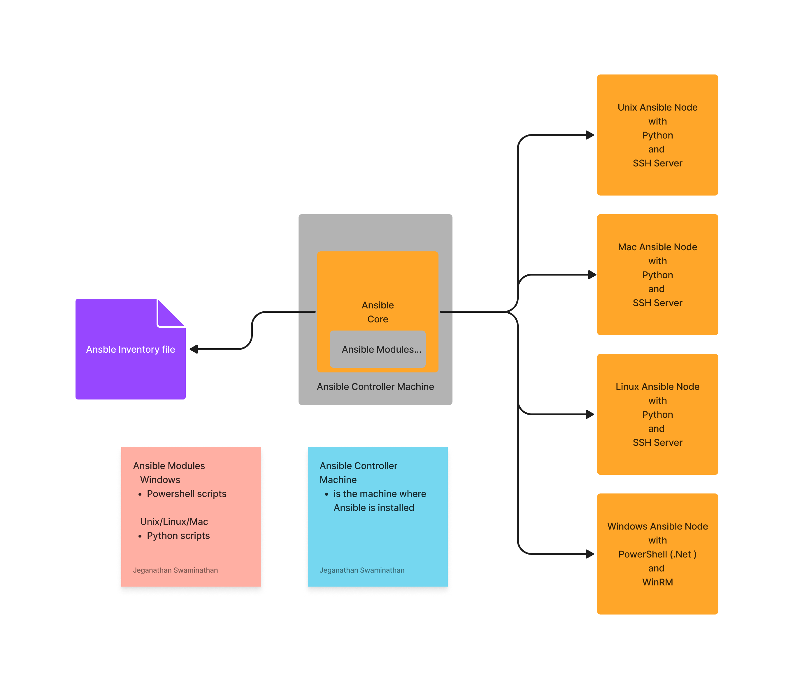

# Day 3

## Programming Language Types
1. Imperative
   Code will have
   1. What and
   2. How
   Examples
    - C/C++, Java, Python, Shell Scripting, Batch Files, Powershell, etc
    - they are very powerful
    - are not apt tools for Configuration Management
      - because you will end up writing lengthy code which is difficult to understand and maintain
      
2. Declarative
   - YAML 
   - In declarative languages, you just need to convey what you would like to automate and leave the how part to Ansible

## What is Configuration Management Tool?
- used by generally DevOps Engineers to automate Software installation and configurations
- given a machine with OS, Configuration Management Tool can install any software and configure those softwares or configure the OS with different user with certain privilege, etc.,
- Ansible can also provision a Docker container, Virtual Machine or an ec2 instance in aws but it doesn't fall under the Provisioner Tool

## What is a Provisioner Tool?
- Provisioner Tools can create a new Virtual Machine on-prem or can spin-off a new ec2 instance on public/private/hybrid cloud environment
- these tools are primarily used to provision a new machine with some Operating System
- Examples
  - Docker
  - Vagrant
  - Cloudformation
  - Terraform

## What is an Orchestration Tool?
- Orchestration Tools like Docker SWARM, Google Kubernetes or Red Hat OpenShift manage containerized applications
- Orchestration tools helps in monitoring the health of your application deployed in Kubernetes/OpenShift cluster and repairs when they get aborted or get killed or crashes or stops responding
- Orchestration Platforms are self-healing platforms
    - they can repair themseleves as well can repair application deployed within the Orchestration platform
- provides an ecosystem for your deployed application and make them Highly Available (HA)
- helps in scaling up/down your containerized application instances on demand
  i.e when the user-traffic to your application increases, they can auto-scale up the number of instance of your microservice/application based on user-defined rules/metrics
  When the user-traffic to your application decreases, they can auto-scale down the number of instances of your microservice/application based on user-defined rules/metrics
- rolling update
  - helps in upgrading/degrading your live application from one version to other without downtime

## Ansible Overview
- is developed in Python
- is developed by Michael Deehan as open source tool with help from open source community/contributors
- Michael Deehan is former employee of Red Hat
- Michael Deehan has quit Red Hat and founded Ansible Inc organization and started developing Ansible Core - open source Configuration Management Tool
- Ansible uses YAML (Yet Another Markup Language ) as its DSL

## Ansible Alternatives
- Puppet
  - DSL used is Ruby
- Chef
  - DSL used is Ruby
- Salt/Salt Stack

## What is an Ansible inventory file?
- is a text file that can created using any plain text editor of your choice
- it has SSH connection details to Unix/Linux/Mac Ansible Nodes(Servers) that you wish to manage using Ansible
- it has Windows WinRM connection details to Windows Ansible Nodes(Servers) that you wish to manage using Ansible

## What is the use of ansible.cfg file in Ansible?
- use this ansible.cfg configuration file to capture/manage configurations
- this file can be kept in multiple places
- Ansible looks for ANSIBLE_CONFIG environment variable, if the env variable points to ansible.cfg in some location on your system, ansible uses that config file
- If in case ANSIBLE_CONFIG environment variable isn't defined, then ansible looks ansible.cfg file in your current directory, if it is there it will use that
- If Ansible isn't able find the ansible.cfg neither using in ANSIBLE_CONFIG environment varible nor in the current directory, then it looks into your home directory for file named .ansible.cfg if it finds it will use that.
- As a last resort, it uses the /etc/ansible/ansible.cfg if ansible couldn't find the ansible.cfg in the earlier locations

## What is DSL?
- Domain Specific Language
- is the language in which we automate things

## What is an Ansible Controller Machine(ACM)?
- the machine where Ansible is installed is the Ansible Controller Machine
- Ansible Controller Machines must be a Linux machine 
- but it seems to work in Mac/Unix
- Ansible Controller Machine(ACM) can never be a Microsoft Windows OS
- but Ansible can manage machines(Ansible Nodes) with Unix/Mac/Linux/Windows OS

## What is Ansible Node?
- Ansible Node are the servers that you wish to automate software installations
- Ansible Node can be a Container, Virtual Machine, could be a Physical Server with some OS, ec2 instance in AWS
- Windows Ansible Node
  - Pre-requisites ( Software requirements )
    - PowerShell should be available
    - .Net Framework should be there
    - WinRM shoud be enabled/configured
- Unix/Linux/Mac Ansible Nodes
  - Pre-requisities ( Software requirements )
    - Python should be installed
    - SSH Server should be installed
  
## Difference betweeen Ansible Core and Ansible Tower
- Ansible comes in 3 flavours
  1. Ansible Core 
     - open source
     - Command Line Interface (CLI)
     - is installed typically in your Laptop/Desktop
     
  2. Ansible Tower
     - Red Hat Product is developed on top of AWX
     - You can't develop Ansible Playbook, we can run the pre-existing Playbook
     - comes with Web Console (Web based GUI)
     - can run the Playbook via GUI from your Web browser
     - supports User Management
     - you get graphics metrics
     - you can historical logs of all your Ansible playbook executions
     - you will get support from Red Hat

  3. AWX
     - works and looks like Ansible Tower
     - comes with WebConsole just like Ansible Tower but it is a opensource
     - you won't get a support
     - developed on top of Ansible Core
     
## Ansible High Level Architecture


# Ansible Commands

## ⛹️‍♂️ Lab - Finding Ansible Version
```
ansible --version
```

Expected output
<pre>
[jegan@tektutor.org Day3]$ <b>ansible --version</b>
ansible [core 2.11.12] 
  config file = /home/jegan/.ansible.cfg
  configured module search path = ['/home/jegan/.ansible/plugins/modules', '/usr/share/ansible/plugins/modules']
  ansible python module location = /home/jegan/.local/lib/python3.6/site-packages/ansible
  ansible collection location = /home/jegan/.ansible/collections:/usr/share/ansible/collections
  executable location = /home/jegan/.local/bin/ansible
  python version = 3.6.8 (default, Nov 16 2020, 16:55:22) [GCC 4.8.5 20150623 (Red Hat 4.8.5-44)]
  jinja version = 3.0.3
  libyaml = True
</pre>


## ⛹️‍♂️ Lab -  Creating key pair ( Do it as non-admin user )
```
ssh-keygen
```

Expected output
<pre>
[jegan@tektutor.org DockerAnsibleUbuntuNodeImage]$ <b>ssh-keygen</b>
Generating public/private rsa key pair.
Enter file in which to save the key (/home/jegan/.ssh/id_rsa): 
Created directory '/home/jegan/.ssh'.
Enter passphrase (empty for no passphrase): 
Enter same passphrase again: 
Your identification has been saved in /home/jegan/.ssh/id_rsa.
Your public key has been saved in /home/jegan/.ssh/id_rsa.pub.
The key fingerprint is:
SHA256:o8JAjpp6SY/7e3uaFb7pfLp85oN1RrFB+rcp3t1OqXk jegan@tektutor.org
The key's randomart image is:
+---[RSA 2048]----+
|           ..    |
|           .o    |
|  .       .  +   |
| +         .o    |
|. o     S  .. .  |
|...o   o o. o. o.|
|o. +o . oo o. o..|
|. + ...=oo=. ooE.|
|...ooo+=OB...oo.+|
+----[SHA256]-----+
</pre>

## ⛹️‍♂️ Lab -  Building custom ubuntu ansible node image
```
cd ~/devops-september-2022
git pull
cd Day3/DockerAnsibleUbuntuNodeImage
cp /home/rps/.ssh/id_rsa.pub authorized_keys

docker build -t tektutor/ubuntu-ansible-node:latest .
```

Expected output
<pre>
[jegan@tektutor.org DockerAnsibleUbuntuNodeImage]$ <b>docker build -t tektutor/ubuntu-ansible-node:latest .</b>
Sending build context to Docker daemon  3.584kB
Step 1/12 : FROM ubuntu:16.04
 ---> b6f507652425
Step 2/12 : MAINTAINER Jeganathan Swaminathan <jegan@tektutor.org>
 ---> Running in aad49f00992b
Removing intermediate container aad49f00992b
 ---> bcd2b42fe843
Step 3/12 : RUN apt-get update && apt-get install -y openssh-server python3
 ---> Running in 9f763bf8fb2c
Get:1 http://archive.ubuntu.com/ubuntu xenial InRelease [247 kB]
Get:2 http://security.ubuntu.com/ubuntu xenial-security InRelease [99.8 kB]
Get:3 http://archive.ubuntu.com/ubuntu xenial-updates InRelease [99.8 kB]
Get:4 http://archive.ubuntu.com/ubuntu xenial-backports InRelease [97.4 kB]
Get:5 http://archive.ubuntu.com/ubuntu xenial/main amd64 Packages [1558 kB]
Get:6 http://security.ubuntu.com/ubuntu xenial-security/main amd64 Packages [2051 kB]
Get:7 http://archive.ubuntu.com/ubuntu xenial/restricted amd64 Packages [14.1 kB]
Get:8 http://archive.ubuntu.com/ubuntu xenial/universe amd64 Packages [9827 kB]
Get:9 http://archive.ubuntu.com/ubuntu xenial/multiverse amd64 Packages [176 kB]
Get:10 http://archive.ubuntu.com/ubuntu xenial-updates/main amd64 Packages [2560 kB]
Get:11 http://security.ubuntu.com/ubuntu xenial-security/restricted amd64 Packages [15.9 kB]
Get:12 http://security.ubuntu.com/ubuntu xenial-security/universe amd64 Packages [984 kB]
Get:13 http://security.ubuntu.com/ubuntu xenial-security/multiverse amd64 Packages [8820 B]
Get:14 http://archive.ubuntu.com/ubuntu xenial-updates/restricted amd64 Packages [16.4 kB]
Get:15 http://archive.ubuntu.com/ubuntu xenial-updates/universe amd64 Packages [1544 kB]
Get:16 http://archive.ubuntu.com/ubuntu xenial-updates/multiverse amd64 Packages [26.2 kB]
Get:17 http://archive.ubuntu.com/ubuntu xenial-backports/main amd64 Packages [10.9 kB]
Get:18 http://archive.ubuntu.com/ubuntu xenial-backports/universe amd64 Packages [12.7 kB]
Fetched 19.3 MB in 4s (4256 kB/s)
Reading package lists...
Reading package lists...
Building dependency tree...
Reading state information...
The following additional packages will be installed:
  ca-certificates dh-python file krb5-locales libbsd0 libedit2 libexpat1
  libgssapi-krb5-2 libidn11 libk5crypto3 libkeyutils1 libkrb5-3
  libkrb5support0 libmagic1 libmpdec2 libpython3-stdlib libpython3.5-minimal
  libpython3.5-stdlib libsqlite3-0 libssl1.0.0 libwrap0 libx11-6 libx11-data
  libxau6 libxcb1 libxdmcp6 libxext6 libxmuu1 mime-support ncurses-term
  openssh-client openssh-sftp-server openssl python3-chardet python3-minimal
  python3-pkg-resources python3-requests python3-six python3-urllib3 python3.5
  python3.5-minimal ssh-import-id tcpd wget xauth
Suggested packages:
  libdpkg-perl krb5-doc krb5-user ssh-askpass libpam-ssh keychain monkeysphere
  rssh molly-guard ufw python3-doc python3-tk python3-venv python3-setuptools
  python3-ndg-httpsclient python3-openssl python3-pyasn1 python3.5-venv
  python3.5-doc binutils binfmt-support
The following NEW packages will be installed:
  ca-certificates dh-python file krb5-locales libbsd0 libedit2 libexpat1
  libgssapi-krb5-2 libidn11 libk5crypto3 libkeyutils1 libkrb5-3
  libkrb5support0 libmagic1 libmpdec2 libpython3-stdlib libpython3.5-minimal
  libpython3.5-stdlib libsqlite3-0 libssl1.0.0 libwrap0 libx11-6 libx11-data
  libxau6 libxcb1 libxdmcp6 libxext6 libxmuu1 mime-support ncurses-term
  openssh-client openssh-server openssh-sftp-server openssl python3
  python3-chardet python3-minimal python3-pkg-resources python3-requests
  python3-six python3-urllib3 python3.5 python3.5-minimal ssh-import-id tcpd
  wget xauth
0 upgraded, 47 newly installed, 0 to remove and 0 not upgraded.
Need to get 10.5 MB of archives.
After this operation, 55.0 MB of additional disk space will be used.
Get:1 http://archive.ubuntu.com/ubuntu xenial-updates/main amd64 libssl1.0.0 amd64 1.0.2g-1ubuntu4.20 [1083 kB]
Get:2 http://archive.ubuntu.com/ubuntu xenial-updates/main amd64 libpython3.5-minimal amd64 3.5.2-2ubuntu0~16.04.13 [524 kB]
Get:3 http://archive.ubuntu.com/ubuntu xenial-updates/main amd64 libexpat1 amd64 2.1.0-7ubuntu0.16.04.5 [71.5 kB]
Get:4 http://archive.ubuntu.com/ubuntu xenial-updates/main amd64 python3.5-minimal amd64 3.5.2-2ubuntu0~16.04.13 [1597 kB]
Get:5 http://archive.ubuntu.com/ubuntu xenial/main amd64 python3-minimal amd64 3.5.1-3 [23.3 kB]
Get:6 http://archive.ubuntu.com/ubuntu xenial/main amd64 mime-support all 3.59ubuntu1 [31.0 kB]
Get:7 http://archive.ubuntu.com/ubuntu xenial/main amd64 libmpdec2 amd64 2.4.2-1 [82.6 kB]
Get:8 http://archive.ubuntu.com/ubuntu xenial-updates/main amd64 libsqlite3-0 amd64 3.11.0-1ubuntu1.5 [398 kB]
Get:9 http://archive.ubuntu.com/ubuntu xenial-updates/main amd64 libpython3.5-stdlib amd64 3.5.2-2ubuntu0~16.04.13 [2135 kB]
Get:10 http://archive.ubuntu.com/ubuntu xenial-updates/main amd64 python3.5 amd64 3.5.2-2ubuntu0~16.04.13 [165 kB]
Get:11 http://archive.ubuntu.com/ubuntu xenial/main amd64 libpython3-stdlib amd64 3.5.1-3 [6818 B]
Get:12 http://archive.ubuntu.com/ubuntu xenial-updates/main amd64 dh-python all 2.20151103ubuntu1.2 [73.9 kB]
Get:13 http://archive.ubuntu.com/ubuntu xenial/main amd64 python3 amd64 3.5.1-3 [8710 B]
Get:14 http://archive.ubuntu.com/ubuntu xenial/main amd64 libxau6 amd64 1:1.0.8-1 [8376 B]
Get:15 http://archive.ubuntu.com/ubuntu xenial/main amd64 libxdmcp6 amd64 1:1.1.2-1.1 [11.0 kB]
Get:16 http://archive.ubuntu.com/ubuntu xenial/main amd64 libxcb1 amd64 1.11.1-1ubuntu1 [40.0 kB]
Get:17 http://archive.ubuntu.com/ubuntu xenial-updates/main amd64 libx11-data all 2:1.6.3-1ubuntu2.2 [114 kB]
Get:18 http://archive.ubuntu.com/ubuntu xenial-updates/main amd64 libx11-6 amd64 2:1.6.3-1ubuntu2.2 [572 kB]
Get:19 http://archive.ubuntu.com/ubuntu xenial/main amd64 libxext6 amd64 2:1.3.3-1 [29.4 kB]
Get:20 http://archive.ubuntu.com/ubuntu xenial/main amd64 libwrap0 amd64 7.6.q-25 [46.2 kB]
Get:21 http://archive.ubuntu.com/ubuntu xenial-updates/main amd64 libmagic1 amd64 1:5.25-2ubuntu1.4 [216 kB]
Get:22 http://archive.ubuntu.com/ubuntu xenial-updates/main amd64 file amd64 1:5.25-2ubuntu1.4 [21.2 kB]
Get:23 http://archive.ubuntu.com/ubuntu xenial-updates/main amd64 libbsd0 amd64 0.8.2-1ubuntu0.1 [42.0 kB]
Get:24 http://archive.ubuntu.com/ubuntu xenial-updates/main amd64 libidn11 amd64 1.32-3ubuntu1.2 [46.5 kB]
Get:25 http://archive.ubuntu.com/ubuntu xenial-updates/main amd64 openssl amd64 1.0.2g-1ubuntu4.20 [492 kB]
Get:26 http://archive.ubuntu.com/ubuntu xenial-updates/main amd64 ca-certificates all 20210119~16.04.1 [148 kB]
Get:27 http://archive.ubuntu.com/ubuntu xenial-updates/main amd64 krb5-locales all 1.13.2+dfsg-5ubuntu2.2 [13.7 kB]
Get:28 http://archive.ubuntu.com/ubuntu xenial/main amd64 libedit2 amd64 3.1-20150325-1ubuntu2 [76.5 kB]
Get:29 http://archive.ubuntu.com/ubuntu xenial-updates/main amd64 libkrb5support0 amd64 1.13.2+dfsg-5ubuntu2.2 [31.2 kB]
Get:30 http://archive.ubuntu.com/ubuntu xenial-updates/main amd64 libk5crypto3 amd64 1.13.2+dfsg-5ubuntu2.2 [81.2 kB]
Get:31 http://archive.ubuntu.com/ubuntu xenial/main amd64 libkeyutils1 amd64 1.5.9-8ubuntu1 [9904 B]
Get:32 http://archive.ubuntu.com/ubuntu xenial-updates/main amd64 libkrb5-3 amd64 1.13.2+dfsg-5ubuntu2.2 [273 kB]
Get:33 http://archive.ubuntu.com/ubuntu xenial-updates/main amd64 libgssapi-krb5-2 amd64 1.13.2+dfsg-5ubuntu2.2 [120 kB]
Get:34 http://archive.ubuntu.com/ubuntu xenial/main amd64 libxmuu1 amd64 2:1.1.2-2 [9674 B]
Get:35 http://archive.ubuntu.com/ubuntu xenial-updates/main amd64 openssh-client amd64 1:7.2p2-4ubuntu2.10 [590 kB]
Get:36 http://archive.ubuntu.com/ubuntu xenial-updates/main amd64 wget amd64 1.17.1-1ubuntu1.5 [299 kB]
Get:37 http://archive.ubuntu.com/ubuntu xenial/main amd64 xauth amd64 1:1.0.9-1ubuntu2 [22.7 kB]
Get:38 http://archive.ubuntu.com/ubuntu xenial/main amd64 ncurses-term all 6.0+20160213-1ubuntu1 [249 kB]
Get:39 http://archive.ubuntu.com/ubuntu xenial-updates/main amd64 openssh-sftp-server amd64 1:7.2p2-4ubuntu2.10 [38.8 kB]
Get:40 http://archive.ubuntu.com/ubuntu xenial-updates/main amd64 openssh-server amd64 1:7.2p2-4ubuntu2.10 [335 kB]
Get:41 http://archive.ubuntu.com/ubuntu xenial/main amd64 python3-pkg-resources all 20.7.0-1 [79.0 kB]
Get:42 http://archive.ubuntu.com/ubuntu xenial/main amd64 python3-chardet all 2.3.0-2 [96.2 kB]
Get:43 http://archive.ubuntu.com/ubuntu xenial/main amd64 python3-six all 1.10.0-3 [11.0 kB]
Get:44 http://archive.ubuntu.com/ubuntu xenial-updates/main amd64 python3-urllib3 all 1.13.1-2ubuntu0.16.04.4 [58.6 kB]
Get:45 http://archive.ubuntu.com/ubuntu xenial-updates/main amd64 python3-requests all 2.9.1-3ubuntu0.1 [55.8 kB]
Get:46 http://archive.ubuntu.com/ubuntu xenial/main amd64 tcpd amd64 7.6.q-25 [23.0 kB]
Get:47 http://archive.ubuntu.com/ubuntu xenial/main amd64 ssh-import-id all 5.5-0ubuntu1 [10.2 kB]
debconf: delaying package configuration, since apt-utils is not installed
Fetched 10.5 MB in 3s (3448 kB/s)
Selecting previously unselected package libssl1.0.0:amd64.
(Reading database ... 4785 files and directories currently installed.)
Preparing to unpack .../libssl1.0.0_1.0.2g-1ubuntu4.20_amd64.deb ...
Unpacking libssl1.0.0:amd64 (1.0.2g-1ubuntu4.20) ...
Selecting previously unselected package libpython3.5-minimal:amd64.
Preparing to unpack .../libpython3.5-minimal_3.5.2-2ubuntu0~16.04.13_amd64.deb ...
Unpacking libpython3.5-minimal:amd64 (3.5.2-2ubuntu0~16.04.13) ...
Selecting previously unselected package libexpat1:amd64.
Preparing to unpack .../libexpat1_2.1.0-7ubuntu0.16.04.5_amd64.deb ...
Unpacking libexpat1:amd64 (2.1.0-7ubuntu0.16.04.5) ...
Selecting previously unselected package python3.5-minimal.
Preparing to unpack .../python3.5-minimal_3.5.2-2ubuntu0~16.04.13_amd64.deb ...
Unpacking python3.5-minimal (3.5.2-2ubuntu0~16.04.13) ...
Selecting previously unselected package python3-minimal.
Preparing to unpack .../python3-minimal_3.5.1-3_amd64.deb ...
Unpacking python3-minimal (3.5.1-3) ...
Selecting previously unselected package mime-support.
Preparing to unpack .../mime-support_3.59ubuntu1_all.deb ...
Unpacking mime-support (3.59ubuntu1) ...
Selecting previously unselected package libmpdec2:amd64.
Preparing to unpack .../libmpdec2_2.4.2-1_amd64.deb ...
Unpacking libmpdec2:amd64 (2.4.2-1) ...
Selecting previously unselected package libsqlite3-0:amd64.
Preparing to unpack .../libsqlite3-0_3.11.0-1ubuntu1.5_amd64.deb ...
Unpacking libsqlite3-0:amd64 (3.11.0-1ubuntu1.5) ...
Selecting previously unselected package libpython3.5-stdlib:amd64.
Preparing to unpack .../libpython3.5-stdlib_3.5.2-2ubuntu0~16.04.13_amd64.deb ...
Unpacking libpython3.5-stdlib:amd64 (3.5.2-2ubuntu0~16.04.13) ...
Selecting previously unselected package python3.5.
Preparing to unpack .../python3.5_3.5.2-2ubuntu0~16.04.13_amd64.deb ...
Unpacking python3.5 (3.5.2-2ubuntu0~16.04.13) ...
Selecting previously unselected package libpython3-stdlib:amd64.
Preparing to unpack .../libpython3-stdlib_3.5.1-3_amd64.deb ...
Unpacking libpython3-stdlib:amd64 (3.5.1-3) ...
Selecting previously unselected package dh-python.
Preparing to unpack .../dh-python_2.20151103ubuntu1.2_all.deb ...
Unpacking dh-python (2.20151103ubuntu1.2) ...
Processing triggers for libc-bin (2.23-0ubuntu11.3) ...
Setting up libssl1.0.0:amd64 (1.0.2g-1ubuntu4.20) ...
debconf: unable to initialize frontend: Dialog
debconf: (TERM is not set, so the dialog frontend is not usable.)
debconf: falling back to frontend: Readline
debconf: unable to initialize frontend: Readline
debconf: (Can't locate Term/ReadLine.pm in @INC (you may need to install the Term::ReadLine module) (@INC contains: /etc/perl /usr/local/lib/x86_64-linux-gnu/perl/5.22.1 /usr/local/share/perl/5.22.1 /usr/lib/x86_64-linux-gnu/perl5/5.22 /usr/share/perl5 /usr/lib/x86_64-linux-gnu/perl/5.22 /usr/share/perl/5.22 /usr/local/lib/site_perl /usr/lib/x86_64-linux-gnu/perl-base .) at /usr/share/perl5/Debconf/FrontEnd/Readline.pm line 7.)
debconf: falling back to frontend: Teletype
Setting up libpython3.5-minimal:amd64 (3.5.2-2ubuntu0~16.04.13) ...
Setting up libexpat1:amd64 (2.1.0-7ubuntu0.16.04.5) ...
Setting up python3.5-minimal (3.5.2-2ubuntu0~16.04.13) ...
Setting up python3-minimal (3.5.1-3) ...
Processing triggers for libc-bin (2.23-0ubuntu11.3) ...
Selecting previously unselected package python3.
(Reading database ... 5761 files and directories currently installed.)
Preparing to unpack .../python3_3.5.1-3_amd64.deb ...
Unpacking python3 (3.5.1-3) ...
Selecting previously unselected package libxau6:amd64.
Preparing to unpack .../libxau6_1%3a1.0.8-1_amd64.deb ...
Unpacking libxau6:amd64 (1:1.0.8-1) ...
Selecting previously unselected package libxdmcp6:amd64.
Preparing to unpack .../libxdmcp6_1%3a1.1.2-1.1_amd64.deb ...
Unpacking libxdmcp6:amd64 (1:1.1.2-1.1) ...
Selecting previously unselected package libxcb1:amd64.
Preparing to unpack .../libxcb1_1.11.1-1ubuntu1_amd64.deb ...
Unpacking libxcb1:amd64 (1.11.1-1ubuntu1) ...
Selecting previously unselected package libx11-data.
Preparing to unpack .../libx11-data_2%3a1.6.3-1ubuntu2.2_all.deb ...
Unpacking libx11-data (2:1.6.3-1ubuntu2.2) ...
Selecting previously unselected package libx11-6:amd64.
Preparing to unpack .../libx11-6_2%3a1.6.3-1ubuntu2.2_amd64.deb ...
Unpacking libx11-6:amd64 (2:1.6.3-1ubuntu2.2) ...
Selecting previously unselected package libxext6:amd64.
Preparing to unpack .../libxext6_2%3a1.3.3-1_amd64.deb ...
Unpacking libxext6:amd64 (2:1.3.3-1) ...
Selecting previously unselected package libwrap0:amd64.
Preparing to unpack .../libwrap0_7.6.q-25_amd64.deb ...
Unpacking libwrap0:amd64 (7.6.q-25) ...
Selecting previously unselected package libmagic1:amd64.
Preparing to unpack .../libmagic1_1%3a5.25-2ubuntu1.4_amd64.deb ...
Unpacking libmagic1:amd64 (1:5.25-2ubuntu1.4) ...
Selecting previously unselected package file.
Preparing to unpack .../file_1%3a5.25-2ubuntu1.4_amd64.deb ...
Unpacking file (1:5.25-2ubuntu1.4) ...
Selecting previously unselected package libbsd0:amd64.
Preparing to unpack .../libbsd0_0.8.2-1ubuntu0.1_amd64.deb ...
Unpacking libbsd0:amd64 (0.8.2-1ubuntu0.1) ...
Selecting previously unselected package libidn11:amd64.
Preparing to unpack .../libidn11_1.32-3ubuntu1.2_amd64.deb ...
Unpacking libidn11:amd64 (1.32-3ubuntu1.2) ...
Selecting previously unselected package openssl.
Preparing to unpack .../openssl_1.0.2g-1ubuntu4.20_amd64.deb ...
Unpacking openssl (1.0.2g-1ubuntu4.20) ...
Selecting previously unselected package ca-certificates.
Preparing to unpack .../ca-certificates_20210119~16.04.1_all.deb ...
Unpacking ca-certificates (20210119~16.04.1) ...
Selecting previously unselected package krb5-locales.
Preparing to unpack .../krb5-locales_1.13.2+dfsg-5ubuntu2.2_all.deb ...
Unpacking krb5-locales (1.13.2+dfsg-5ubuntu2.2) ...
Selecting previously unselected package libedit2:amd64.
Preparing to unpack .../libedit2_3.1-20150325-1ubuntu2_amd64.deb ...
Unpacking libedit2:amd64 (3.1-20150325-1ubuntu2) ...
Selecting previously unselected package libkrb5support0:amd64.
Preparing to unpack .../libkrb5support0_1.13.2+dfsg-5ubuntu2.2_amd64.deb ...
Unpacking libkrb5support0:amd64 (1.13.2+dfsg-5ubuntu2.2) ...
Selecting previously unselected package libk5crypto3:amd64.
Preparing to unpack .../libk5crypto3_1.13.2+dfsg-5ubuntu2.2_amd64.deb ...
Unpacking libk5crypto3:amd64 (1.13.2+dfsg-5ubuntu2.2) ...
Selecting previously unselected package libkeyutils1:amd64.
Preparing to unpack .../libkeyutils1_1.5.9-8ubuntu1_amd64.deb ...
Unpacking libkeyutils1:amd64 (1.5.9-8ubuntu1) ...
Selecting previously unselected package libkrb5-3:amd64.
Preparing to unpack .../libkrb5-3_1.13.2+dfsg-5ubuntu2.2_amd64.deb ...
Unpacking libkrb5-3:amd64 (1.13.2+dfsg-5ubuntu2.2) ...
Selecting previously unselected package libgssapi-krb5-2:amd64.
Preparing to unpack .../libgssapi-krb5-2_1.13.2+dfsg-5ubuntu2.2_amd64.deb ...
Unpacking libgssapi-krb5-2:amd64 (1.13.2+dfsg-5ubuntu2.2) ...
Selecting previously unselected package libxmuu1:amd64.
Preparing to unpack .../libxmuu1_2%3a1.1.2-2_amd64.deb ...
Unpacking libxmuu1:amd64 (2:1.1.2-2) ...
Selecting previously unselected package openssh-client.
Preparing to unpack .../openssh-client_1%3a7.2p2-4ubuntu2.10_amd64.deb ...
Unpacking openssh-client (1:7.2p2-4ubuntu2.10) ...
Selecting previously unselected package wget.
Preparing to unpack .../wget_1.17.1-1ubuntu1.5_amd64.deb ...
Unpacking wget (1.17.1-1ubuntu1.5) ...
Selecting previously unselected package xauth.
Preparing to unpack .../xauth_1%3a1.0.9-1ubuntu2_amd64.deb ...
Unpacking xauth (1:1.0.9-1ubuntu2) ...
Selecting previously unselected package ncurses-term.
Preparing to unpack .../ncurses-term_6.0+20160213-1ubuntu1_all.deb ...
Unpacking ncurses-term (6.0+20160213-1ubuntu1) ...
Selecting previously unselected package openssh-sftp-server.
Preparing to unpack .../openssh-sftp-server_1%3a7.2p2-4ubuntu2.10_amd64.deb ...
Unpacking openssh-sftp-server (1:7.2p2-4ubuntu2.10) ...
Selecting previously unselected package openssh-server.
Preparing to unpack .../openssh-server_1%3a7.2p2-4ubuntu2.10_amd64.deb ...
Unpacking openssh-server (1:7.2p2-4ubuntu2.10) ...
Selecting previously unselected package python3-pkg-resources.
Preparing to unpack .../python3-pkg-resources_20.7.0-1_all.deb ...
Unpacking python3-pkg-resources (20.7.0-1) ...
Selecting previously unselected package python3-chardet.
Preparing to unpack .../python3-chardet_2.3.0-2_all.deb ...
Unpacking python3-chardet (2.3.0-2) ...
Selecting previously unselected package python3-six.
Preparing to unpack .../python3-six_1.10.0-3_all.deb ...
Unpacking python3-six (1.10.0-3) ...
Selecting previously unselected package python3-urllib3.
Preparing to unpack .../python3-urllib3_1.13.1-2ubuntu0.16.04.4_all.deb ...
Unpacking python3-urllib3 (1.13.1-2ubuntu0.16.04.4) ...
Selecting previously unselected package python3-requests.
Preparing to unpack .../python3-requests_2.9.1-3ubuntu0.1_all.deb ...
Unpacking python3-requests (2.9.1-3ubuntu0.1) ...
Selecting previously unselected package tcpd.
Preparing to unpack .../tcpd_7.6.q-25_amd64.deb ...
Unpacking tcpd (7.6.q-25) ...
Selecting previously unselected package ssh-import-id.
Preparing to unpack .../ssh-import-id_5.5-0ubuntu1_all.deb ...
Unpacking ssh-import-id (5.5-0ubuntu1) ...
Processing triggers for libc-bin (2.23-0ubuntu11.3) ...
Processing triggers for systemd (229-4ubuntu21.31) ...
Setting up mime-support (3.59ubuntu1) ...
Setting up libmpdec2:amd64 (2.4.2-1) ...
Setting up libsqlite3-0:amd64 (3.11.0-1ubuntu1.5) ...
Setting up libpython3.5-stdlib:amd64 (3.5.2-2ubuntu0~16.04.13) ...
Setting up python3.5 (3.5.2-2ubuntu0~16.04.13) ...
Setting up libpython3-stdlib:amd64 (3.5.1-3) ...
Setting up libxau6:amd64 (1:1.0.8-1) ...
Setting up libxdmcp6:amd64 (1:1.1.2-1.1) ...
Setting up libxcb1:amd64 (1.11.1-1ubuntu1) ...
Setting up libx11-data (2:1.6.3-1ubuntu2.2) ...
Setting up libx11-6:amd64 (2:1.6.3-1ubuntu2.2) ...
Setting up libxext6:amd64 (2:1.3.3-1) ...
Setting up libwrap0:amd64 (7.6.q-25) ...
Setting up libmagic1:amd64 (1:5.25-2ubuntu1.4) ...
Setting up file (1:5.25-2ubuntu1.4) ...
Setting up libbsd0:amd64 (0.8.2-1ubuntu0.1) ...
Setting up libidn11:amd64 (1.32-3ubuntu1.2) ...
Setting up openssl (1.0.2g-1ubuntu4.20) ...
Setting up ca-certificates (20210119~16.04.1) ...
debconf: unable to initialize frontend: Dialog
debconf: (TERM is not set, so the dialog frontend is not usable.)
debconf: falling back to frontend: Readline
debconf: unable to initialize frontend: Readline
debconf: (Can't locate Term/ReadLine.pm in @INC (you may need to install the Term::ReadLine module) (@INC contains: /etc/perl /usr/local/lib/x86_64-linux-gnu/perl/5.22.1 /usr/local/share/perl/5.22.1 /usr/lib/x86_64-linux-gnu/perl5/5.22 /usr/share/perl5 /usr/lib/x86_64-linux-gnu/perl/5.22 /usr/share/perl/5.22 /usr/local/lib/site_perl /usr/lib/x86_64-linux-gnu/perl-base .) at /usr/share/perl5/Debconf/FrontEnd/Readline.pm line 7.)
debconf: falling back to frontend: Teletype
Setting up krb5-locales (1.13.2+dfsg-5ubuntu2.2) ...
Setting up libedit2:amd64 (3.1-20150325-1ubuntu2) ...
Setting up libkrb5support0:amd64 (1.13.2+dfsg-5ubuntu2.2) ...
Setting up libk5crypto3:amd64 (1.13.2+dfsg-5ubuntu2.2) ...
Setting up libkeyutils1:amd64 (1.5.9-8ubuntu1) ...
Setting up libkrb5-3:amd64 (1.13.2+dfsg-5ubuntu2.2) ...
Setting up libgssapi-krb5-2:amd64 (1.13.2+dfsg-5ubuntu2.2) ...
Setting up libxmuu1:amd64 (2:1.1.2-2) ...
Setting up openssh-client (1:7.2p2-4ubuntu2.10) ...
Setting up wget (1.17.1-1ubuntu1.5) ...
Setting up xauth (1:1.0.9-1ubuntu2) ...
Setting up ncurses-term (6.0+20160213-1ubuntu1) ...
Setting up openssh-sftp-server (1:7.2p2-4ubuntu2.10) ...
Setting up openssh-server (1:7.2p2-4ubuntu2.10) ...
debconf: unable to initialize frontend: Dialog
debconf: (TERM is not set, so the dialog frontend is not usable.)
debconf: falling back to frontend: Readline
debconf: unable to initialize frontend: Readline
debconf: (Can't locate Term/ReadLine.pm in @INC (you may need to install the Term::ReadLine module) (@INC contains: /etc/perl /usr/local/lib/x86_64-linux-gnu/perl/5.22.1 /usr/local/share/perl/5.22.1 /usr/lib/x86_64-linux-gnu/perl5/5.22 /usr/share/perl5 /usr/lib/x86_64-linux-gnu/perl/5.22 /usr/share/perl/5.22 /usr/local/lib/site_perl /usr/lib/x86_64-linux-gnu/perl-base .) at /usr/share/perl5/Debconf/FrontEnd/Readline.pm line 7.)
debconf: falling back to frontend: Teletype
Creating SSH2 RSA key; this may take some time ...
2048 SHA256:SFhLxq3cHop3rUUwfkOsZZ6B5XZnMZoyK0qnrKPAKWE root@9f763bf8fb2c (RSA)
Creating SSH2 DSA key; this may take some time ...
1024 SHA256:agXOkbLjDJ2Jcva8x34s3Q827SNtcJccG0XOMK36Wh8 root@9f763bf8fb2c (DSA)
Creating SSH2 ECDSA key; this may take some time ...
256 SHA256:V/tqAgEO2GoObDfjs6JqqxPqh95h2+2Cx/9WtU62vlE root@9f763bf8fb2c (ECDSA)
Creating SSH2 ED25519 key; this may take some time ...
256 SHA256:fIfOlAOevSf6nFkH//VH4nsixFI/33OVplfoOVAhgiQ root@9f763bf8fb2c (ED25519)
invoke-rc.d: could not determine current runlevel
invoke-rc.d: policy-rc.d denied execution of start.
Setting up tcpd (7.6.q-25) ...
Setting up dh-python (2.20151103ubuntu1.2) ...
Setting up python3 (3.5.1-3) ...
running python rtupdate hooks for python3.5...
running python post-rtupdate hooks for python3.5...
Setting up python3-pkg-resources (20.7.0-1) ...
Setting up python3-chardet (2.3.0-2) ...
Setting up python3-six (1.10.0-3) ...
Setting up python3-urllib3 (1.13.1-2ubuntu0.16.04.4) ...
Setting up python3-requests (2.9.1-3ubuntu0.1) ...
Setting up ssh-import-id (5.5-0ubuntu1) ...
Processing triggers for libc-bin (2.23-0ubuntu11.3) ...
Processing triggers for ca-certificates (20210119~16.04.1) ...
Updating certificates in /etc/ssl/certs...
129 added, 0 removed; done.
Running hooks in /etc/ca-certificates/update.d...
done.
Processing triggers for systemd (229-4ubuntu21.31) ...
Removing intermediate container 9f763bf8fb2c
 ---> a201fe7f0666
Step 4/12 : RUN mkdir /var/run/sshd
 ---> Running in b0c2e676525c
Removing intermediate container b0c2e676525c
 ---> f5a042c9f202
Step 5/12 : RUN echo 'root:root' | chpasswd
 ---> Running in 4e28574bd644
Removing intermediate container 4e28574bd644
 ---> 125b1b7cf434
Step 6/12 : RUN sed -i 's/PermitRootLogin prohibit-password/PermitRootLogin yes/' /etc/ssh/sshd_config
 ---> Running in 96507d182f78
Removing intermediate container 96507d182f78
 ---> e9a1150bee00
Step 7/12 : RUN sed 's@session\s*required\s*pam_loginuid.so@session optional pam_loginuid.so@g' -i /etc/pam.d/sshd
 ---> Running in d09cadad2709
Removing intermediate container d09cadad2709
 ---> fc936f181011
Step 8/12 : RUN mkdir -p /root/.ssh
 ---> Running in 1a98c5bd750a
Removing intermediate container 1a98c5bd750a
 ---> b1fb44cb550b
Step 9/12 : COPY authorized_keys /root/.ssh/authorized_keys
 ---> c5bd5ccef99c
Step 10/12 : EXPOSE 22
 ---> Running in dcbe4c55e0ce
Removing intermediate container dcbe4c55e0ce
 ---> d3fb6fa239b0
Step 11/12 : EXPOSE 80
 ---> Running in 7b96ba2c6a26
Removing intermediate container 7b96ba2c6a26
 ---> ad5d7ee78d4f
Step 12/12 : CMD ["/usr/sbin/sshd", "-D"]
 ---> Running in dca2594d621e
Removing intermediate container dca2594d621e
 ---> dab69bbcefdd
Successfully built dab69bbcefdd
Successfully tagged tektutor/ubuntu-ansible-node:latest
</pre>

## ⛹️‍♂️ Lab -  List and see if the image you build is there
```
docker images
```

Expected output
<pre>
[jegan@tektutor.org devops-september-2022]$ docker images
REPOSITORY                                TAG       IMAGE ID       CREATED          SIZE
<b>tektutor/ubuntu-ansible-node              latest    dab69bbcefdd   21 minutes ago   220MB</b>
mysql                                     latest    43fcfca0776d   13 days ago      449MB
nginx                                     latest    2d389e545974   2 weeks ago      142MB
docker.bintray.io/jfrog/artifactory-oss   latest    e7053142b08e   3 weeks ago      1.24GB
hello-world                               latest    feb5d9fea6a5   12 months ago    13.3kB
ubuntu                                    16.04     b6f507652425   13 months ago    135MB
</pre>

## ⛹️‍♂️ Lab -  Create couple of containers using our custom docker image
We will use the below containers as our Ansible Nodes
```
docker run -d --name ubuntu1 --hostname ubuntu1 -p 2001:22 -p 8001:80 tektutor/ubuntu-ansible-node:latest
docker run -d --name ubuntu2 --hostname ubuntu2 -p 2002:22 -p 8002:80 tektutor/ubuntu-ansible-node:latest
```

Expected output
<pre>
[jegan@tektutor.org devops-september-2022]$ <b>docker run -d --name ubuntu1 --hostname ubuntu1 -p 2001:22 -p 8001:80 tektutor/ubuntu-ansible-node:latest</b>
2e551bf20f1bc784d2462f4b28d7268d9f21fd5c8b5b53e52ea665593984f57d

[jegan@tektutor.org devops-september-2022]$ <b>docker run -d --name ubuntu2 --hostname ubuntu2 -p 2002:22 -p 8002:80 tektutor/ubuntu-ansible-node:latest</b>
a6ed8e80a6518d4fd3f04e458b91dd80e217d6d9466722e5f32048b0f2554dcf

[jegan@tektutor.org devops-september-2022]$ <b>docker ps</b>
CONTAINER ID   IMAGE                                 COMMAND               CREATED         STATUS         PORTS                                                                          NAMES
a6ed8e80a651   tektutor/ubuntu-ansible-node:latest   "/usr/sbin/sshd -D"   3 seconds ago   Up 1 second    0.0.0.0:2002->22/tcp, :::2002->22/tcp, 0.0.0.0:8002->80/tcp, :::8002->80/tcp   ubuntu2
2e551bf20f1b   tektutor/ubuntu-ansible-node:latest   "/usr/sbin/sshd -D"   3 minutes ago   Up 3 minutes   0.0.0.0:2001->22/tcp, :::2001->22/tcp, 0.0.0.0:8001->80/tcp, :::8001->80/tcp   ubuntu1
</pre>

## ⛹️‍♂️ Lab -  Testing the containers - see if you are able to SSH into the containers without password
```
ssh -p 2001 root@localhost
ssh -p 2002 root@localhost
```

Expected output
<pre>
[jegan@tektutor.org devops-september-2022]$ <b>ssh -p 2001 root@localhost</b>
The authenticity of host '[localhost]:2001 ([::1]:2001)' can't be established.
ECDSA key fingerprint is SHA256:V/tqAgEO2GoObDfjs6JqqxPqh95h2+2Cx/9WtU62vlE.
ECDSA key fingerprint is MD5:35:f4:7d:82:4e:c4:d1:77:2e:8e:96:05:4a:91:6b:34.
Are you sure you want to continue connecting (yes/no)? <b>yes</b>
Warning: Permanently added '[localhost]:2001' (ECDSA) to the list of known hosts.
Welcome to Ubuntu 16.04.7 LTS (GNU/Linux 3.10.0-1160.el7.x86_64 x86_64)

 * Documentation:  https://help.ubuntu.com
 * Management:     https://landscape.canonical.com
 * Support:        https://ubuntu.com/advantage

The programs included with the Ubuntu system are free software;
the exact distribution terms for each program are described in the
individual files in /usr/share/doc/*/copyright.

Ubuntu comes with ABSOLUTELY NO WARRANTY, to the extent permitted by
applicable law.

root@ubuntu1:~# exit
logout
Connection to localhost closed.
[jegan@tektutor.org devops-september-2022]$ <b>ssh -p 2002 root@localhost</b>
The authenticity of host '[localhost]:2002 ([::1]:2002)' can't be established.
ECDSA key fingerprint is SHA256:V/tqAgEO2GoObDfjs6JqqxPqh95h2+2Cx/9WtU62vlE.
ECDSA key fingerprint is MD5:35:f4:7d:82:4e:c4:d1:77:2e:8e:96:05:4a:91:6b:34.
Are you sure you want to continue connecting (yes/no)? <b>yes</b>
Warning: Permanently added '[localhost]:2002' (ECDSA) to the list of known hosts.
Welcome to Ubuntu 16.04.7 LTS (GNU/Linux 3.10.0-1160.el7.x86_64 x86_64)

 * Documentation:  https://help.ubuntu.com
 * Management:     https://landscape.canonical.com
 * Support:        https://ubuntu.com/advantage

The programs included with the Ubuntu system are free software;
the exact distribution terms for each program are described in the
individual files in /usr/share/doc/*/copyright.

Ubuntu comes with ABSOLUTELY NO WARRANTY, to the extent permitted by
applicable law.

root@ubuntu2:~# exit
logout
Connection to localhost closed.
</pre>

## ⛹️‍♂️ Lab -  Ansible ping as an Ansible ad-hoc command
```
cd ~/devops-september-2022
git pull
cd Day3/playbooks

ansible -i inventory all -m ping
```

In the above ansible ad-hoc command
<pre>
-i ==> indicates inventory
inventory ==> is the actual inventory file that has connection details to the ubuntu1 and ubuntu2 ansible nodes
all ==> indicates the all group in the inventory, i.e we wish to ping all machines in the inventory
-m ==> indicates module
ping ==> ping.py ansible module
</pre>


Expected output
<pre>
[jegan@tektutor.org playbooks]$ <b>ansible -i inventory all -m ping</b>
ubuntu1 | SUCCESS => {
    "ansible_facts": {
        "discovered_interpreter_python": "/usr/bin/python3"
    },
    "changed": false,
    "ping": "pong"
}
ubuntu2 | SUCCESS => {
    "ansible_facts": {
        "discovered_interpreter_python": "/usr/bin/python3"
    },
    "changed": false,
    "ping": "pong"
}
</pre>

## Lab - Listing the facts gathered by Ansible from Ansible Node
```
cd ~/devops-september-2022
git pull

cd Day3/playbooks
ansible -i inventory ubuntu1 -m setup
```

Ansible invokes the setup module as an implicit task in every playbook as the first task.

Expected output
<pre>
[jegan@tektutor.org playbooks]$ ansible -i inventory ubuntu1 -m setup
ubuntu1 | SUCCESS => {
    "ansible_facts": {
        "ansible_apparmor": {
            "status": "disabled"
        },
        "ansible_architecture": "x86_64",
        "ansible_bios_date": "11/12/2020",
        "ansible_bios_vendor": "Phoenix Technologies LTD",
        "ansible_bios_version": "6.00",
        "ansible_board_asset_tag": "NA",
        "ansible_board_name": "440BX Desktop Reference Platform",
        "ansible_board_serial": "None",
        "ansible_board_vendor": "Intel Corporation",
        "ansible_board_version": "None",
        "ansible_chassis_asset_tag": "No Asset Tag",
        "ansible_chassis_serial": "None",
        "ansible_chassis_vendor": "No Enclosure",
        "ansible_chassis_version": "N/A",
        "ansible_cmdline": {
            "BOOT_IMAGE": "/vmlinuz-3.10.0-1160.el7.x86_64",
            "LANG": "en_US.UTF-8",
            "crashkernel": "auto",
            "quiet": true,
            "rhgb": true,
            "ro": true,
            "root": "UUID=36c47d14-66d8-45c5-b86f-58cf442e2491",
            "spectre_v2": "retpoline"
        },
        "ansible_date_time": {
            "date": "2022-09-28",
            "day": "28",
            "epoch": "1664347497",
            "hour": "06",
            "iso8601": "2022-09-28T06:44:57Z",
            "iso8601_basic": "20220928T064457194460",
            "iso8601_basic_short": "20220928T064457",
            "iso8601_micro": "2022-09-28T06:44:57.194460Z",
            "minute": "44",
            "month": "09",
            "second": "57",
            "time": "06:44:57",
            "tz": "UTC",
            "tz_dst": "UTC",
            "tz_offset": "+0000",
            "weekday": "Wednesday",
            "weekday_number": "3",
            "weeknumber": "39",
            "year": "2022"
        },
        "ansible_device_links": {
            "ids": {},
            "labels": {},
            "masters": {},
            "uuids": {}
        },
        "ansible_devices": {
            "sda": {
                "holders": [],
                "host": "",
                "links": {
                    "ids": [],
                    "labels": [],
                    "masters": [],
                    "uuids": []
                },
                "model": "VMware Virtual S",
                "partitions": {
                    "sda1": {
                        "holders": [],
                        "links": {
                            "ids": [],
                            "labels": [],
                            "masters": [],
                            "uuids": []
                        },
                        "sectors": "614400",
                        "sectorsize": 512,
                        "size": "300.00 MB",
                        "start": "2048",
                        "uuid": null
                    },
                    "sda2": {
                        "holders": [],
                        "links": {
                            "ids": [],
                            "labels": [],
                            "masters": [],
                            "uuids": []
                        },
                        "sectors": "10485760",
                        "sectorsize": 512,
                        "size": "5.00 GB",
                        "start": "616448",
                        "uuid": null
                    },
                    "sda3": {
                        "holders": [],
                        "links": {
                            "ids": [],
                            "labels": [],
                            "masters": [],
                            "uuids": []
                        },
                        "sectors": "93755392",
                        "sectorsize": 512,
                        "size": "44.71 GB",
                        "start": "11102208",
                        "uuid": null
                    }
                },
                "removable": "0",
                "rotational": "1",
                "sas_address": null,
                "sas_device_handle": null,
                "scheduler_mode": "deadline",
                "sectors": "104857600",
                "sectorsize": "512",
                "size": "50.00 GB",
                "support_discard": "0",
                "vendor": "VMware,",
                "virtual": 1
            },
            "sr0": {
                "holders": [],
                "host": "",
                "links": {
                    "ids": [],
                    "labels": [],
                    "masters": [],
                    "uuids": []
                },
                "model": "VMware IDE CDR00",
                "partitions": {},
                "removable": "1",
                "rotational": "1",
                "sas_address": null,
                "sas_device_handle": null,
                "scheduler_mode": "deadline",
                "sectors": "125160",
                "sectorsize": "2048",
                "size": "61.11 MB",
                "support_discard": "0",
                "vendor": "NECVMWar",
                "virtual": 1
            },
            "sr1": {
                "holders": [],
                "host": "",
                "links": {
                    "ids": [],
                    "labels": [],
                    "masters": [],
                    "uuids": []
                },
                "model": "VMware IDE CDR10",
                "partitions": {},
                "removable": "1",
                "rotational": "1",
                "sas_address": null,
                "sas_device_handle": null,
                "scheduler_mode": "deadline",
                "sectors": "19922944",
                "sectorsize": "2048",
                "size": "9.50 GB",
                "support_discard": "0",
                "vendor": "NECVMWar",
                "virtual": 1
            }
        },
        "ansible_distribution": "Ubuntu",
        "ansible_distribution_file_parsed": true,
        "ansible_distribution_file_path": "/etc/os-release",
        "ansible_distribution_file_variety": "Debian",
        "ansible_distribution_major_version": "16",
        "ansible_distribution_release": "xenial",
        "ansible_distribution_version": "16.04",
        "ansible_dns": {
            "nameservers": [
                "192.168.167.2"
            ],
            "search": [
                "localdomain",
                "org"
            ]
        },
        "ansible_domain": "",
        "ansible_effective_group_id": 0,
        "ansible_effective_user_id": 0,
        "ansible_env": {
            "HOME": "/root",
            "LANG": "C",
            "LC_ALL": "C",
            "LC_MESSAGES": "C",
            "LOGNAME": "root",
            "MAIL": "/var/mail/root",
            "PATH": "/usr/local/sbin:/usr/local/bin:/usr/sbin:/usr/bin:/sbin:/bin:/usr/games:/usr/local/games:/snap/bin",
            "PWD": "/root",
            "SHELL": "/bin/bash",
            "SHLVL": "1",
            "SSH_CLIENT": "172.17.0.1 36366 22",
            "SSH_CONNECTION": "172.17.0.1 36366 172.17.0.2 22",
            "SSH_TTY": "/dev/pts/0",
            "TERM": "xterm-256color",
            "USER": "root",
            "_": "/bin/sh"
        },
        "ansible_fibre_channel_wwn": [],
        "ansible_fips": false,
        "ansible_form_factor": "Other",
        "ansible_fqdn": "ubuntu1",
        "ansible_hostname": "ubuntu1",
        "ansible_hostnqn": "",
        "ansible_is_chroot": false,
        "ansible_iscsi_iqn": "",
        "ansible_kernel": "3.10.0-1160.el7.x86_64",
        "ansible_kernel_version": "#1 SMP Mon Oct 19 16:18:59 UTC 2020",
        "ansible_local": {},
        "ansible_lsb": {
            "codename": "xenial",
            "description": "Ubuntu 16.04.7 LTS",
            "id": "Ubuntu",
            "major_release": "16",
            "release": "16.04"
        },
        "ansible_machine": "x86_64",
        "ansible_memfree_mb": 5953,
        "ansible_memory_mb": {
            "nocache": {
                "free": 13122,
                "used": 2744
            },
            "real": {
                "free": 5953,
                "total": 15866,
                "used": 9913
            },
            "swap": {
                "cached": 0,
                "free": 5119,
                "total": 5119,
                "used": 0
            }
        },
        "ansible_memtotal_mb": 15866,
        "ansible_mounts": [
            {
                "block_available": 9007885,
                "block_size": 4096,
                "block_total": 11713702,
                "block_used": 2705817,
                "device": "/dev/sda3",
                "fstype": "xfs",
                "inode_available": 23142240,
                "inode_total": 23438848,
                "inode_used": 296608,
                "mount": "/etc/hostname",
                "options": "rw,seclabel,relatime,attr2,inode64,noquota,bind",
                "size_available": 36896296960,
                "size_total": 47979323392,
                "uuid": "N/A"
            },
            {
                "block_available": 9007885,
                "block_size": 4096,
                "block_total": 11713702,
                "block_used": 2705817,
                "device": "/dev/sda3",
                "fstype": "xfs",
                "inode_available": 23142240,
                "inode_total": 23438848,
                "inode_used": 296608,
                "mount": "/etc/resolv.conf",
                "options": "rw,seclabel,relatime,attr2,inode64,noquota,bind",
                "size_available": 36896296960,
                "size_total": 47979323392,
                "uuid": "N/A"
            },
            {
                "block_available": 9007885,
                "block_size": 4096,
                "block_total": 11713702,
                "block_used": 2705817,
                "device": "/dev/sda3",
                "fstype": "xfs",
                "inode_available": 23142240,
                "inode_total": 23438848,
                "inode_used": 296608,
                "mount": "/etc/hosts",
                "options": "rw,seclabel,relatime,attr2,inode64,noquota,bind",
                "size_available": 36896296960,
                "size_total": 47979323392,
                "uuid": "N/A"
            }
        ],
        "ansible_nodename": "ubuntu1",
        "ansible_os_family": "Debian",
        "ansible_pkg_mgr": "apt",
        "ansible_proc_cmdline": {
            "BOOT_IMAGE": "/vmlinuz-3.10.0-1160.el7.x86_64",
            "LANG": "en_US.UTF-8",
            "crashkernel": "auto",
            "quiet": true,
            "rhgb": true,
            "ro": true,
            "root": "UUID=36c47d14-66d8-45c5-b86f-58cf442e2491",
            "spectre_v2": "retpoline"
        },
        "ansible_processor": [
            "0",
            "GenuineIntel",
            "Intel(R) Xeon(R) Silver 4214R CPU @ 2.40GHz",
            "1",
            "GenuineIntel",
            "Intel(R) Xeon(R) Silver 4214R CPU @ 2.40GHz",
            "2",
            "GenuineIntel",
            "Intel(R) Xeon(R) Silver 4214R CPU @ 2.40GHz",
            "3",
            "GenuineIntel",
            "Intel(R) Xeon(R) Silver 4214R CPU @ 2.40GHz"
        ],
        "ansible_processor_cores": 2,
        "ansible_processor_count": 2,
        "ansible_processor_nproc": 4,
        "ansible_processor_threads_per_core": 1,
        "ansible_processor_vcpus": 4,
        "ansible_product_name": "VMware Virtual Platform",
        "ansible_product_serial": "VMware-56 4d 92 db 82 ad d9 13-69 d9 6e 5e ef ea c9 7e",
        "ansible_product_uuid": "DB924D56-AD82-13D9-69D9-6E5EEFEAC97E",
        "ansible_product_version": "None",
        "ansible_python": {
            "executable": "/usr/bin/python3",
            "has_sslcontext": true,
            "type": "cpython",
            "version": {
                "major": 3,
                "micro": 2,
                "minor": 5,
                "releaselevel": "final",
                "serial": 0
            },
            "version_info": [
                3,
                5,
                2,
                "final",
                0
            ]
        },
        "ansible_python_version": "3.5.2",
        "ansible_real_group_id": 0,
        "ansible_real_user_id": 0,
        "ansible_selinux": {
            "status": "disabled"
        },
        "ansible_selinux_python_present": true,
        "ansible_service_mgr": "sshd",
        "ansible_ssh_host_key_dsa_public": "AAAAB3NzaC1kc3MAAACBAMf69JQNH3XSZ+8ISLVTJpSAWz76vXjOKRhkRSp2gbqFxf6t6ygV1pga+nRtB4kFRi8SeyjGbnbCdtYDqYMGXKld62YJgoMKuulZU2w9GtvXQYijbT/ei6+tpK657GbCARbNps3HW4/voTKN5bHTF9ciiD6WEmh9QSLdvu3dk1AxAAAAFQDrkw7DocfPJSn6DxbPPOt1CgStIQAAAIEAxDVdbQD4x2/JUQ7qIx+b+0yjXtmBQQkdMjt5ltuo84UANZSeZ2+WLDY7/YLcQ4g+fqoZC++npg/ISiiHl2bNUgQ0+LZzXc5CiU0Zs9uTHGE01PgWhXBLTvp4doHW4BJEC1V4JNF88px7Q2Cwq6dHIapGFtYM8wNuZOeWwH6Q7eMAAACAYSlxpzkOxXZ0ZbDRFKlATLbFYgeOwnjNPrRRGkcQ23u/8B5MvetR0Ceva772JKnH5nlb2hx0xcyqe25rb4a0lyQUREq3YPXgT3NVvU1FWVXh7/k/DUjGpq2SLrRyiGK40oo9yxwgKueRuuy6J5WzQnoj7E0VIKO8HWDp87Ypvjk=",
        "ansible_ssh_host_key_dsa_public_keytype": "ssh-dss",
        "ansible_ssh_host_key_ecdsa_public": "AAAAE2VjZHNhLXNoYTItbmlzdHAyNTYAAAAIbmlzdHAyNTYAAABBBJUp2aaFUoM8Qr8cnsgaHkILuLZYIwwT/5c/3Az9rOMwhbAABCcb9qdvg8eXUr+UB+xP5hjidbxy1Ia5yuFFkBQ=",
        "ansible_ssh_host_key_ecdsa_public_keytype": "ecdsa-sha2-nistp256",
        "ansible_ssh_host_key_ed25519_public": "AAAAC3NzaC1lZDI1NTE5AAAAIFUj97Lx89dlnytWfZCqKt7NkuNdAUBHFMS+1E4Y8XuZ",
        "ansible_ssh_host_key_ed25519_public_keytype": "ssh-ed25519",
        "ansible_ssh_host_key_rsa_public": "AAAAB3NzaC1yc2EAAAADAQABAAABAQCtupfdlVoC9HW9L3ABLG9e2chz+2Zb/9BawRJwSgyvWo8cgEU1Foua8D9uSm9qeLHJ631/JqUhoYeqOLIKhaiiz4rZ8yPHIvaKh/oiLJkEznW1lASIb7p505WSjbvaI+wrRZHoPSyAJCmXzsRR2qBQxtvYBBZKWJeBPPE2lz0oBb5LBuYY+OAcKCIbyDL/xedoRnEsJMGGeWXcErAOVThQjIxI/3bHER7A7oYUkTtOUk1u0THgb2tMjifeabuDGFSVbL1E4Sihexd0JQHpAtDNntxaYlE92cHGnLaOH9Sm2TbT4js3pvNGD2TP+ZsN0hsepU1/VIFizU+AW3Ao2yK/",
        "ansible_ssh_host_key_rsa_public_keytype": "ssh-rsa",
        "ansible_swapfree_mb": 5119,
        "ansible_swaptotal_mb": 5119,
        "ansible_system": "Linux",
        "ansible_system_capabilities": [
            "cap_chown",
            "cap_dac_override",
            "cap_fowner",
            "cap_fsetid",
            "cap_kill",
            "cap_setgid",
            "cap_setuid",
            "cap_setpcap",
            "cap_net_bind_service",
            "cap_net_raw",
            "cap_sys_chroot",
            "cap_mknod",
            "cap_audit_write",
            "cap_setfcap+ep"
        ],
        "ansible_system_capabilities_enforced": "True",
        "ansible_system_vendor": "VMware, Inc.",
        "ansible_uptime_seconds": 181579,
        "ansible_user_dir": "/root",
        "ansible_user_gecos": "root",
        "ansible_user_gid": 0,
        "ansible_user_id": "root",
        "ansible_user_shell": "/bin/bash",
        "ansible_user_uid": 0,
        "ansible_userspace_architecture": "x86_64",
        "ansible_userspace_bits": "64",
        "ansible_virtualization_role": "guest",
        "ansible_virtualization_tech_guest": [
            "container",
            "docker",
            "VMware"
        ],
        "ansible_virtualization_tech_host": [],
        "ansible_virtualization_type": "docker",
        "discovered_interpreter_python": "/usr/bin/python3",
        "gather_subset": [
            "all"
        ],
        "module_setup": true
    },
    "changed": false
}
</pre>
